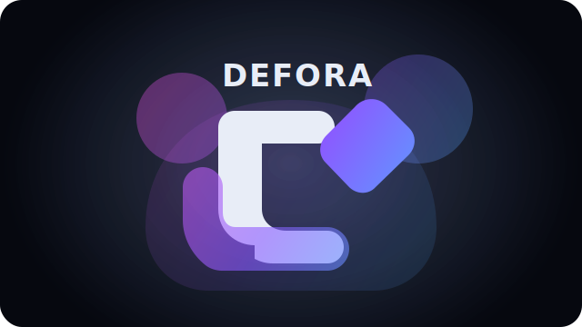

# Defora — audio-visual instrument for Stahle Diffusion Forge/Deforumation

<p align="center">
  
</p>

Defora turns Stable Diffusion Forge + Deforumation into a playable instrument: live visuals, prompt morphing, camera motion, beat-synced controls, and a neon-styled web UI for performance.

## Requires
- Moderately fast GPU (4070ti / 5060ti tested) with at least 12G VRAM
- Models that have either Lightning support or accompanying LORa that need 1-2 steps for a frame. SDXL Lightning is proven to be working fine
- 32GB ram is minimum, 64gb ram recommended
- Stable Diffusion Forge + Deforum extension from **https://github.com/Tok/sd-forge-deforum** and **https://github.com/lllyasviel/stable-diffusion-webui-forge**
- There is docker stack including these in the package but it is recommended to run on external node 

## What’s inside
- `forge_cli` — model-aware txt2img/Deforum CLI with preset support and sensible defaults.
- `deforumation_request_dispatcher` — merges manifests/presets/overrides and runs `forge_cli` for rerun/continue flows.
- `deforumation_runs_cli` — curses TUI to browse run manifests, set overrides, and emit rerun/continue request files (can auto-dispatch).
- `deforumation_cli_panel` — live mediator control panel (strength/CFG/noise/pan/zoom/rot/FOV) with re-bindable hotkeys.
- `deforumation_dashboard` — curses dashboard echoing the Deforumation GUI tabs (prompts, prompt mixer, motions, control toggles, audio sync, settings) using the upstream config JSON. Presets: load with `--preset <name>` (from `deforumation/presets/<name>.json`) and save with `--save-preset <name>`.
- `audio_reactive_modulator` — map audio bands to mediator parameters; output a schedule or stream live.
- `monitor_cli` — tail the latest frames and show live mediator values.
- `stream_helper` — push rendered frames to RTMP/SRT/WHIP via ffmpeg.
- `docker-compose` stack — ffmpeg encoder + Nginx/Node (HLS + authable controls) + RabbitMQ + mediator control bridge to view frames as live video in a browser.
- Docs and schema helpers under `docs/` (run manifest schema, workflows, server targeting, panel notes).

## Feature Status

For a comprehensive overview of implemented features, phased development plan, and testing status, see **[FEATURES_STATUS.md](FEATURES_STATUS.md)**. This document tracks:
- Implementation status of all 5 development phases
- Test coverage and known issues
- Contribution guidelines for incomplete features
- Documentation completeness

## Quick start
1) Clone and install deps:
```bash
git clone https://github.com/janiluuk/defora.git
cd defora
git submodule update --init --recursive
# or: ./scripts/clone_deforumation.sh
pip install -r requirements.txt
```
2) Start Forge (with `--deforum-api` for Deforum).

3) Pick a tool:
- Generate stills/animations with defaults: `./forge_cli "a synthwave city at night"` or `./forge_cli deforum -f 240 "surreal biomechanical cathedral"`
- Browse and rerun/continue saved runs: `./deforumation_runs_cli`
- Merge presets/overrides and dispatch: `./deforumation_request_dispatcher --request runs/<id>/rerun_request.json --execute`
- Live control panel (mediator): `./deforumation_cli_panel --host 127.0.0.1 --port 8766`
- Deforumation-style dashboard (tabs like `github_images/`): `./deforumation_dashboard --config deforumation/helpers/DeforumationSendConfig.json`
- Defora TUI (full multi-tab ncurses instrument): `./defora_tui`
- Audio-driven parameters: `./audio_reactive_modulator --audio song.wav --fps 24 --output audio_mod.json` (add `--live --mediator-host ... --mediator-port ...` to stream)
- Monitor frames + live values: `./monitor_cli --frames runs/<id>/frames`
- Stream frames via ffmpeg: `./stream_helper start --source runs/<id>/frames --target rtmp://example/live/key --fps 24`
- Spin up the web streaming stack: `docker-compose up --build` then open `http://localhost:8080` (see `docs/streaming_stack.md`).
- Web UI tabs (performer-focused): LIVE (macro sliders + motion presets), PROMPTS (morph & slots), MOTION (gamepad-style cam + curves), AUDIO/BEATS (waveform + beat actions), CONTROLNET (slot cards), SETTINGS (quick render presets).

## Key concepts
- **Audio-visual instrument**: Treat prompts, camera, and ControlNet as live parameters; drive them via CLI/TUI/Web or controllers.
- **Presets & manifests**: Deforum JSON presets and run manifests can be merged with CLI overrides. The runs TUI writes `*_request.json` that the dispatcher consumes.
- **Mediator control**: The panel, dashboard, and audio modulator talk to the mediator websocket so you can steer generation without the full UI.
- **Model-aware defaults**: `forge_cli` picks steps/CFG/sampler based on the active model (Flux/SDXL/SD1.5) and can auto-switch to Flux-schnell.

## Mediator (DeforumationQT)
- The DeforumationQT mediator is vendored under `deforumation/`. Run it to bridge SD-Forge/Deforum to the Deforumation UI and our CLI tools (panel/dashboard/audio modulator).
- See `docs/mediator_setup.md` for mediator startup steps and for installing the sd-forge Deforum bridge from `deforumation/Deforum_Version/sd-forge/`.
- Docker users: `docker-compose up --build mediator sd-forge` will start the mediator (ports 8765/8766) and a Forge container with the Deforumation-patched Deforum extension pre-installed (UI on port 7860).

## Environment knobs
- `FORGE_API_BASE` — target Forge server (e.g., `http://192.168.2.101:7860`).
- `FORGE_OUT_DIR` — output directory for `forge_cli`.
- `DEFORUMATION_FORGE_CLI` — path override for Forge CLI when auto-dispatching.
- `DEFORUMATION_AUTO_DISPATCH=1` — have `deforumation_runs_cli` immediately dispatch requests.
- `DEFORUMATION_FRAMES_DIR` — default frames path for `monitor_cli`.
- `DEFORUMATION_ASCII_PREVIEW=1` — enable ASCII thumbnails in monitor/runs TUI (needs Pillow).
- `DEFORUMATION_MEDIATOR_HOST`/`DEFORUMATION_MEDIATOR_PORT` — defaults for mediator-backed UIs (panel, dashboard, monitor).
- `CONTROL_TOKEN` — WebSocket control token for the web UI (set when running docker-compose).
- `MEDIATOR_HOST` (compose bridge) — set this if `host.docker.internal` is not available on your host (common on Linux) so the control bridge can reach the mediator.
- Web MIDI: enable in your browser and map controls in the web UI (MIDI tab) to live parameters.

## Layout
- CLI/package code: `defora_cli/`
- Executable wrappers: `./forge_cli`, `./deforumation_request_dispatcher`, `./deforumation_runs_cli`, `./deforumation_cli_panel`, `./deforumation_dashboard`, `./defora_tui`, `./monitor_cli`, `./stream_helper`, `./audio_reactive_modulator`
- Web UI & streaming stack: `docker-compose.yml`, `docker/web/` (Nginx+Node+Vue front-end, HLS, controls), `docker/bridge/` (mediator bridge)
- Docs: `docs/` (workflows, server targeting, schema, streaming)
- Tests: `tests/` (Python) and `docker/web/test` (web UI smoke tests)
- Logo: `assets/defora_logo.svg` (dark-mode friendly, neon gradient)

## Testing
Run the suite (requires pytest installed):
```bash
./scripts/run_tests.sh  # or: python -m pytest
```
