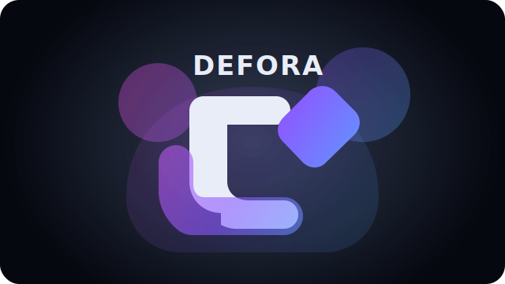
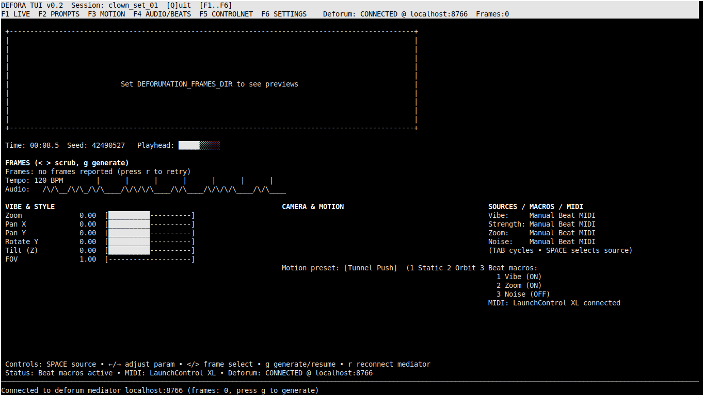
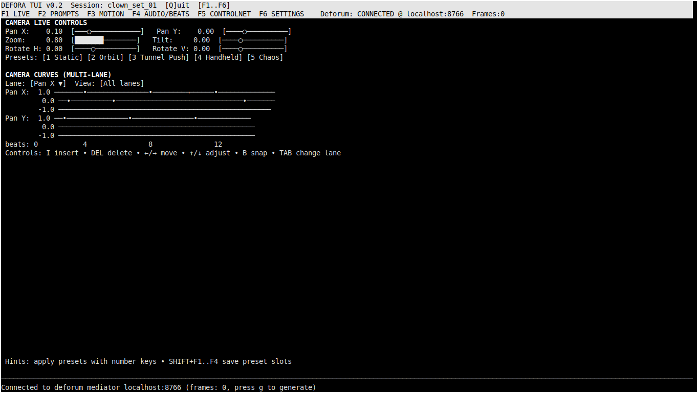
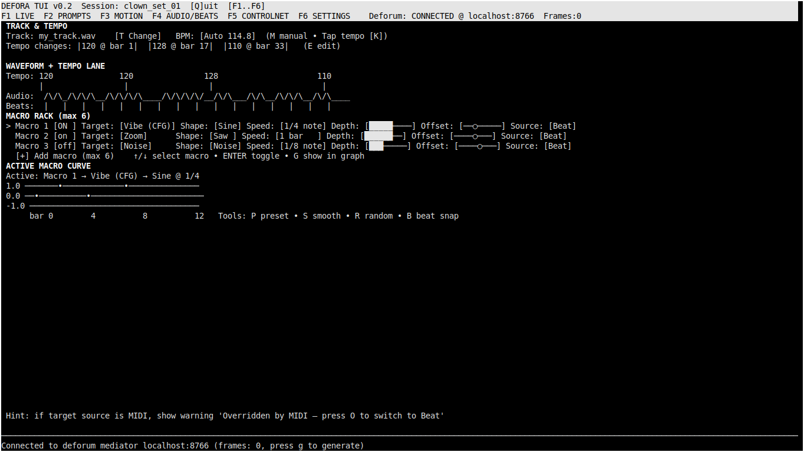

# Defora — audio-visual instrument for Stable Diffusion Forge/Deforumation

<p align="center">
  
</p>

Defora turns Stable Diffusion Forge + Deforumation into a playable instrument: live visuals, prompt morphing, camera motion, beat-synced controls, and a neon-styled web UI for performance.
https://defora.dudeisland.eu/

## Current Browser Tour

Top-level tabs (web UI): **LIVE · PROMPTS · MOTION · MODULATION · AUDIO · SETTINGS** (RUNS / GENERATE / STREAM redirect — see [`docker/web/docs/UI-FEATURE-FLOW.md`](docker/web/docs/UI-FEATURE-FLOW.md)). Stream output: **Settings → Output**. Annotated screenshots: [`docs/ui-migration/00-README.md`](docs/ui-migration/00-README.md).

<table>
<tr>
<td width="50%">
<h4>LIVE</h4>

<p>The stage fills the right half; the left panel switches between <b>Controls</b> (animation engine, layer selector, preview source) and <b>Deforum</b>. Stage HUDs: pinned params, modulating-now, morph crossfader, recent-runs rail. Layer bar at bottom cycles WebGL / Deforum / WAN / AnimateLCM / Both / Input.</p>
</td>
<td width="50%">
<h4>PROMPTS</h4>

<p>Sub-tabs PROMPTS / IMAGE / LORA / CONTROLNET / STORY. Style modifier, prompt morph enable, and plugin registry. A/B morph crossfader lives on the LIVE stage HUD — not duplicated here.</p>
</td>
</tr>
<tr>
<td width="50%">
<h4>MOTION</h4>

<p>Preset pills above a full-view XY hero pad with accent puck glow. Fine-tune toggle reveals macro sliders. Animation sequencer timeline docks at the bottom; 3D path preview in advanced panel.</p>
</td>
<td width="50%">
<h4>MODULATION</h4>

<p>Waveform-first LFO cards — compact meta when collapsed, full controls when selected. Sub-tabs LFO / Audio / Reactive / Beat / Mappings. Teal active, dim idle chrome.</p>
</td>
</tr>
<tr>
<td width="50%">
<h4>AUDIO</h4>

<p>First-class reactive tab: quick-band pills (sub · bass · mid · …) above a tall spectrum hero. Frequency-to-parameter mapping cards with live meters.</p>
</td>
<td width="50%">
<h4>RUNS</h4>

<p>Full-page runs monitor — active jobs, past runs, frames rail. Kill queued batches, inspect JSON diff, re-run or continue from detail pane.</p>
</td>
</tr>
<tr>
<td width="50%">
<h4>GENERATE</h4>

<p>Dedicated timeline dock under preview with playhead/duration/frame/FPS sync readout. Clips, keyframes, markers, and Apply-to-Deforum workflow.</p>
</td>
<td width="50%">
<h4>SETTINGS — Engine</h4>

<p>Checkpoint GlassPanel with CFG/steps/sampler summary. Advanced sampling, resolution, LCM, and seed in progressive disclosure panel.</p>
</td>
</tr>
<tr>
<td width="50%">
<h4>SETTINGS — Output</h4>

<p>Stream preview, HLS/RTMP addresses, and active output destinations. Replaces the former top-level STREAM tab; HLS watch also available from the status strip on LIVE.</p>
</td>
<td width="50%">
<h4>LIBRARY</h4>

<p>Fullscreen workspace from the header Library icon. Browse Frames, Runs, Uploads, HLS, VideoSwarm; cloud connect; Open in editor.</p>
</td>
</tr>
</table>

## ✨ Feature Highlights

### 🎹 Live Performance Interface
Browser-based stage with real-time layer switching:

<table>
<tr>
<td width="50%">
<h4>Web UI — Stage + Controls</h4>

<p>Animation engine picker, video layer selector (WebGL / Deforum / WAN Video / Both / Input), and preview source toggle. Status bar shows health, session ID, and live frame rate.</p>
</td>
<td width="50%">
<h4>TUI — Terminal Control Center</h4>

<p>Full ncurses interface with ASCII frame preview and parameter sliders. F1–F7 to switch tabs, ←/→ to adjust values.</p>
</td>
</tr>
</table>

### 🎨 Prompt Morphing & Style
A/B prompt blending, style modifiers, and LoRA crossfader:

<table>
<tr>
<td width="50%">

<p><b>Prompts tab:</b> Forge-compatible style presets with preview toggle, and a Prompt Morphing section with enable/disable and an A→B crossfader slider.</p>
</td>
<td width="50%">

<p><b>LoRA sub-tab:</b> A-group / B-group palettes with a crossfader that can be driven manually or by any LFO slot for tempo-synced style morphing.</p>
</td>
</tr>
</table>

### 🎥 Camera Motion & Sequencer
XY performance pads, presets, and the animation timeline:

<table>
<tr>
<td width="50%">

<p><b>Web UI:</b> Move and Look XY pads with Static / Orbit / Tunnel / Handheld / Chaos presets. Animation Sequencer timeline docks below the pads with loop, prompt, and LoRA controls.</p>
</td>
<td width="50%">

<p><b>TUI:</b> Multi-lane Deforum schedule editor. Edit zoom, translation, and rotation curves from your terminal.</p>
</td>
</tr>
</table>

### 🎵 Modulation — LFO, Audio & Beat
Six LFO slots routed to any parameter:

<table>
<tr>
<td width="50%">

<p><b>Modulation Patch Bay:</b> LFO / Audio / Reactive / Beat / Mappings tabs. Each slot shows waveform, BPM sync, speed, depth, and armed target. The Targets panel lists every active route.</p>
</td>
<td width="50%">

<p><b>TUI:</b> Beat-synced parameter automation and audio-reactive schedule generation.</p>
</td>
</tr>
</table>

### 🎛️ Engine, ControlNet & Settings
Checkpoint, sampler, and GPU pool configuration:

<table>
<tr>
<td width="50%">

<p><b>ENGINE sub-tab:</b> Active checkpoint card, inline CFG / steps / sampler / scheduler controls, LCM Engine toggle, resolution, seed mode, and model-specific profile buttons. CONTROLLERS / MIDI and GPU POOL sub-tabs also live here.</p>
</td>
<td width="50%">

<p><b>ControlNet sub-tab (under PROMPTS):</b> Per-slot model picker filtered to the active checkpoint family, weight slider with visual strength indicator, and enable/disable toggle per slot.</p>
</td>
</tr>
</table>

### 🎼 MIDI Controller Support
Map any MIDI controller to live parameters:
- **Web UI**: Browser-based Web MIDI — bind knobs and faders in **Settings → Controllers / MIDI**
- **TUI**: CC learn mode with per-parameter binding
- Full parameter control via hardware controllers at performance time

## Requires
- Moderately fast GPU (4070ti / 5060ti tested) with at least 12G VRAM
- Models that have either Lightning support or accompanying LORa that need 1-2 steps for a frame. SDXL Lightning is proven to be working fine
- 32GB ram is minimum, 64gb ram recommended
- Stable Diffusion Forge + Deforum extension from **https://github.com/Tok/sd-forge-deforum** and **https://github.com/lllyasviel/stable-diffusion-webui-forge**
- There is docker stack including these in the package but it is recommended to run on external node 

## 📦 What's Inside

### Core Tools
- **`forge_cli`** — Model-aware txt2img/Deforum CLI with preset support and sensible defaults
- **`defora_tui`** — Full multi-tab ncurses interface (LIVE, PROMPTS, LORA, MOTION, AUDIO, CONTROLNET, SETTINGS)
- **`deforumation_cli_panel`** — Lightweight control panel with rebindable hotkeys (strength/CFG/noise/pan/zoom/rot/FOV)
- **`deforumation_dashboard`** — Curses dashboard mirroring the Deforumation GUI tabs

### Audio & Modulation
- **`audio_reactive_modulator`** — Map audio bands to mediator parameters; output schedules or stream live
- **Beat-synced macros** — Drive parameters with tempo-aligned modulation

### Run Management
- **`deforumation_runs_cli`** — Browse run manifests, set overrides, rerun/continue generations
- **`deforumation_request_dispatcher`** — Merge manifests/presets/overrides and execute runs
- **`monitor_cli`** — Tail latest frames and show live mediator values

### Streaming & Output
- **`stream_helper`** — Push rendered frames to RTMP/SRT/WHIP via ffmpeg
- **Web streaming stack** — Docker compose with ffmpeg encoder, Nginx/Node (HLS), RabbitMQ, and mediator bridge
- **Web UI** — Browser-based performance interface with WebSocket controls and HLS video

### Documentation
- **`docs/`** — Architecture, workflows, server targeting, schemas, troubleshooting guides


## 🚀 Quick Start

### 1. Clone and Install
```bash
git clone https://github.com/janiluuk/defora.git
cd defora
git submodule update --init --recursive
# or: ./scripts/clone_deforumation.sh
pip install -r requirements.txt
```

### 2. Start Stable Diffusion Forge
Start Forge with Deforum API enabled:
```bash
# Example: assuming Forge is installed in ~/stable-diffusion-webui-forge
cd ~/stable-diffusion-webui-forge
./webui.sh --deforum-api
```

### 3. Choose Your Interface

#### 🎹 Quick Generation (Command Line)
Generate images or animations with smart defaults:
```bash
# Single image
./forge_cli "a synthwave city at night"

# Animation (240 frames)
./forge_cli deforum -f 240 "surreal biomechanical cathedral"

# img2img (requires running Forge)
./forge_cli img2img --init-image ./ref.png "enhance details, cinematic" --denoising-strength 0.55

# Inpainting (mask image, same size as init recommended)
./forge_cli img2img --init-image ./scene.png --mask-image ./mask.png \
  "object removal, clean background" --denoising-strength 0.72
```

#### 🎮 Live Performance (Web UI)
Full browser-based performance interface:
```bash
docker-compose up --build
# Open http://localhost:8080
```
**Features**: Live macro sliders, prompt morphing, motion curves, audio sync, MIDI control

#### 💻 Terminal Control (TUI)
Full-featured ncurses interface for terminal users:
```bash
./defora_tui
```
**Navigation**: F1–F7 to switch tabs (incl. **LORA** on F3), ←/→ to adjust parameters, Q to quit

#### 🎛️ Lightweight Panel (CLI)
Minimal control panel with hotkey bindings:
```bash
./deforumation_cli_panel --host 127.0.0.1 --port 8766
```

### 4. Advanced Tools

**Browse & Rerun Saved Generations:**
```bash
./deforumation_runs_cli
```

**Audio-Reactive Modulation:**
```bash
# Generate audio schedule
./audio_reactive_modulator --audio song.wav --fps 24 --output audio_mod.json

# Stream live to mediator
./audio_reactive_modulator --audio song.wav --fps 24 --live \
  --mediator-host 127.0.0.1 --mediator-port 8766

# Optional post-pass on the generated schedule (module:function)
./audio_reactive_modulator --audio song.wav --fps 24 --output out.json \
  --post-plugin defora_cli.plugins.audio_post:process
```

**Monitor Live Generation:**
```bash
./monitor_cli --frames runs/<id>/frames
```

**Stream to RTMP/SRT:**
```bash
./stream_helper start --source runs/<id>/frames \
  --target rtmp://example/live/key --fps 24
```

## Key concepts
- **Audio-visual instrument**: Treat prompts, camera, and ControlNet as live parameters; drive them via CLI/TUI/Web or controllers.
- **Presets & manifests**: Deforum JSON presets and run manifests can be merged with CLI overrides. The runs TUI writes `*_request.json` that the dispatcher consumes.
- **Mediator control**: The panel, dashboard, and audio modulator talk to the mediator websocket so you can steer generation without the full UI.
- **Model-aware defaults**: `forge_cli` picks steps/CFG/sampler based on the active model (Flux/SDXL/SD1.5) and can auto-switch to Flux-schnell.

## Mediator (DeforumationQT)
- The DeforumationQT mediator is vendored under `deforumation/`. Run it to bridge SD-Forge/Deforum to the Deforumation UI and our CLI tools (panel/dashboard/audio modulator).
- See `docs/mediator_setup.md` for mediator startup steps and for installing the sd-forge Deforum bridge from `deforumation/Deforum_Version/sd-forge/`.
- Docker users: `docker-compose up --build mediator sd-forge` will start the mediator (ports 8765/8766) and a Forge container with the Deforumation-patched Deforum extension pre-installed (UI on port 7860).

## Environment knobs
- `FORGE_API_BASE` — Python CLI target Forge server (e.g., `http://192.168.2.101:7860`).
- `SD_FORGE_HOST` / `SD_FORGE_PORT` — **web stack** Forge hostname and port (Docker Compose defaults to `sd-forge:7860`).
- `FORGE_OUT_DIR` — output directory for `forge_cli`.
- `DEFORUMATION_FORGE_CLI` — path override for Forge CLI when auto-dispatching.
- `DEFORUMATION_AUTO_DISPATCH=1` — have `deforumation_runs_cli` immediately dispatch requests.
- `DEFORUMATION_FRAMES_DIR` — default frames path for `monitor_cli`.
- `DEFORUMATION_ASCII_PREVIEW=1` — enable ASCII thumbnails in monitor/runs TUI (needs Pillow).
- `DEFORUMATION_MEDIATOR_HOST`/`DEFORUMATION_MEDIATOR_PORT` — defaults for mediator-backed UIs (panel, dashboard, monitor).
- `CONTROL_TOKEN` — WebSocket control token for the web UI (set when running docker-compose).
- `MEDIATOR_HOST` (compose bridge) — set this if `host.docker.internal` is not available on your host (common on Linux) so the control bridge can reach the mediator.
- `SD_FORGE_POLL_MS` — if set to a positive value (milliseconds) on the **web** stack, the API periodically probes SD-Forge so `/api/status` and the Web UI Forge indicator stay current without opening model list endpoints.
- `SEQUENCER_DIR` — directory for saved animation sequencer timelines (Web UI MOTION tab); default is `docker/web/sequencers` next to the Node server.
- `DEFORA_TUI_LORA_STATE` — optional path for `defora_tui` LoRA tab save/load (JSON); default `~/.config/defora/tui_lora.json`.
- `PLUGINS_DIR` — optional directory for `docker/web/plugins/manifest.json` (Web `GET /api/plugins`). CLI post-plugins use a separate registry: `defora_cli/plugins/manifest.json` (see `defora_cli.plugins`).
- Web MIDI: enable in your browser and map controls in the **Settings** tab (Controllers / WebMIDI) to live parameters.

## Project Status & Roadmap

See [ROADMAP.md](ROADMAP.md) for:
- Current feature status and completeness
- Unfinished/in-progress features
- Planned features and timeline
- Long-term vision and goals

## Deploy (production)

Same pattern as Sparkki: rsync + remote Docker Compose via jumphost `pi@sparkki.dudeisland.eu:4322` → `root@192.168.2.100:/srv/defora`.

```bash
./scripts/production-deploy.sh
```

GitHub Actions: [`.github/workflows/deploy-production.yml`](.github/workflows/deploy-production.yml) (after green CI on `main`, or manual dispatch). Requires secret `DEPLOY_SSH_PRIVATE_KEY`. See [`docs/deploy.md`](docs/deploy.md).

## Layout
- CLI/package code: `defora_cli/`
- Executable wrappers: `./forge_cli`, `./deforumation_request_dispatcher`, `./deforumation_runs_cli`, `./deforumation_cli_panel`, `./deforumation_dashboard`, `./defora_tui`, `./monitor_cli`, `./stream_helper`, `./audio_reactive_modulator`
- Web UI & streaming stack: `docker-compose.yml`, `docker/web/` (Nginx+Node+Vue front-end, HLS, controls), `docker/bridge/` (mediator bridge)
- Docs: `docs/` (workflows, server targeting, schema, streaming)
- Tests: `tests/` (Python) and `docker/web/test` (web UI smoke tests)
- Logo: `assets/defora_logo.svg` (dark-mode friendly, neon gradient)

## Testing
Run the suite (requires pytest installed):
```bash
./scripts/run_tests.sh  # or: python -m pytest
```
