# Defora UI — feature flow graph

**Status:** living document — edit before restructuring UI logic.  
**Repo path:** `docker/web/docs/UI-FEATURE-FLOW.md`  
**Companion:** [`UX-NAVIGATION-MAP.md`](UX-NAVIGATION-MAP.md) (collision/shortcut audit) · [`README.md`](README.md) (workflow)

| | |
|--|--|
| **Purpose** | Map where features live today and where they *should* live after your edit. |
| **How to edit** | Change node labels, move subgraphs, add/remove edges. Mermaid renders in GitHub, VS Code, and Cursor preview. |
| **Code sources** | `src/App.vue`, `src/components/views/*.vue`, `src/components/AnimationEnginePanel.vue` |
| **Implement** | After you finalize a section here, update the matching view + `switchTab` / `subTabIdsForCurrentTab` in `App.vue`. |

### Top nav (current code)

`LIVE` · `PROMPTS` · `MOTION` · `MODULATION` · `AUDIO` · `SETTINGS`  
(No top-level RUNS / GENERATE / STREAM — those redirect; see §2.)

### Restructure phases (implementation log)

| Phase | Theme | Status |
|-------|--------|--------|
| **IA-1** | Docs: flow graph + index (`UI-FEATURE-FLOW.md`) | **Done** |
| **IA-2** | Engine Deforum settings + panel docks + PLUGINS in Settings | **Done** |
| **IA-3** | Discoverability: LIVE summary + `LiveParametersPanel`, prompt schedule link, help/popovers, FOV → `F`, morph status pill, layer rail labels | **Done** |
| **IA-4** | AUDIO tab reference upload; merge MODULATION/AUDIO paths | **Done** |
| **IA-5** | Orphans: `VideoSwarmBrowser`, compositor dedupe, GENERATE context | **Done** |

Edit this table when you change the target layout in §10.

---

## 1. App shell (always visible)

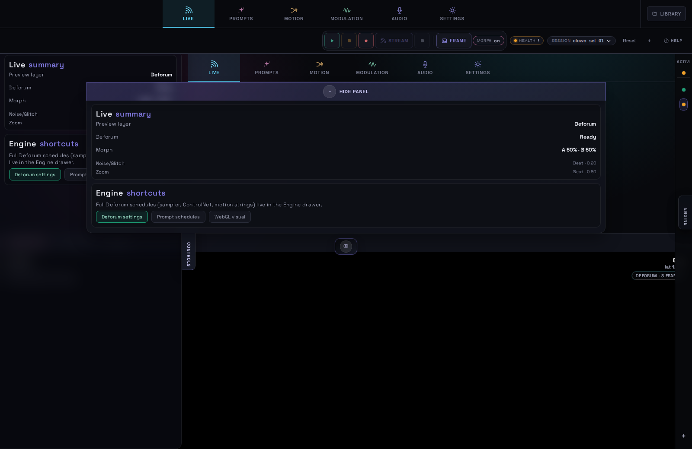

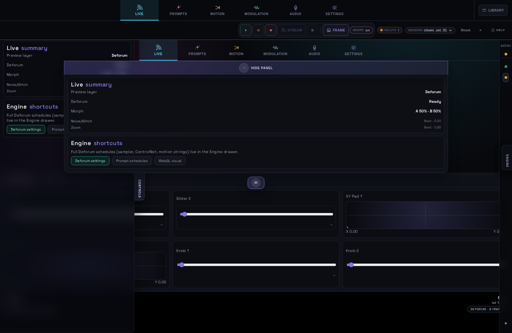

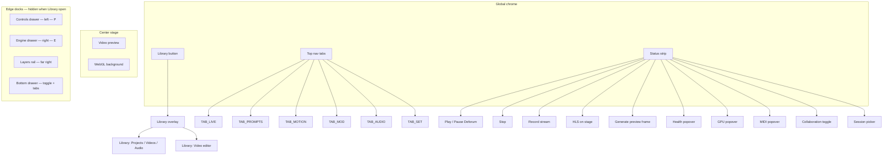

---

## 2. Top-level tab routing

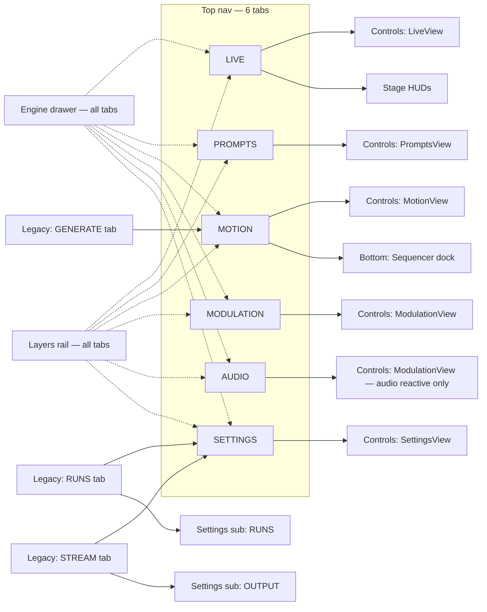

---

## 3. LIVE tab

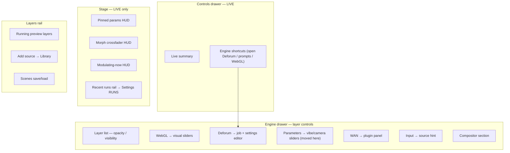

---

## 4. PROMPTS tab

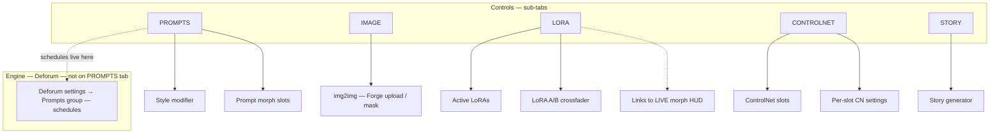

---

## 5. MOTION tab

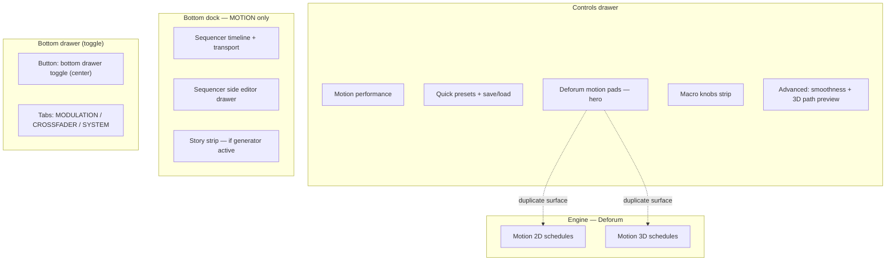

---

## 6. MODULATION + AUDIO tabs

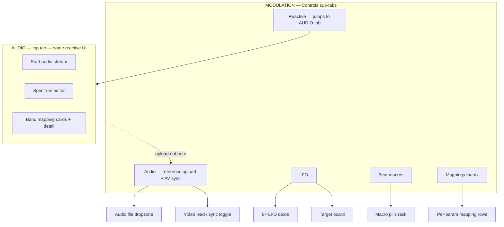

---

## 7. SETTINGS tab

```mermaid
flowchart TB
  subgraph set_sub["SETTINGS — Controls sub-tabs"]
    S_ENG["ENGINE"]
    S_OUT["OUTPUT"]
    S_GPU["GPUS"]
    S_RUN["RUNS"]
    S_MIDI["MIDI"]
    S_STY["STYLES"]
    S_PLUG["PLUGINS"]
    S_COL["COLLAB"]
  end

  S_ENG --> CKPT["Checkpoint picker"]
  S_ENG --> SAMP["Sampler / scheduler / steps / CFG"]
  S_ENG --> RES["Resolution + global FPS"]
  S_ENG --> LCM["LCM engine panel"]

  S_OUT --> STREAM["StreamView — HLS preview + endpoints"]

  S_GPU --> HEALTH["Service health"]
  S_GPU --> STACK["Mediator + transcoders"]
  S_GPU --> POOL["GPU pool + Forge instance editor"]

  S_RUN --> RUN_MON["Runs monitor"]
  S_RUN --> RUN_ACT["Active runs"]
  S_RUN --> RUN_FR["Frames rail"]
  S_RUN --> RUN_PAST["Past runs search"]

  S_MIDI --> MIDI_DEV["MIDI devices + CC table"]
  S_MIDI --> KEYS["Keyboard bindings"]
  S_MIDI --> PRESETS["Local + shared presets"]

  S_STY --> STYLES["Prompt styles CRUD + Forge import"]

  S_PLUG --> REG["Plugins registry list"]

  S_COL --> WS["WS users / locks / session recordings"]
```

---

## 8. Engine drawer — per-layer detail

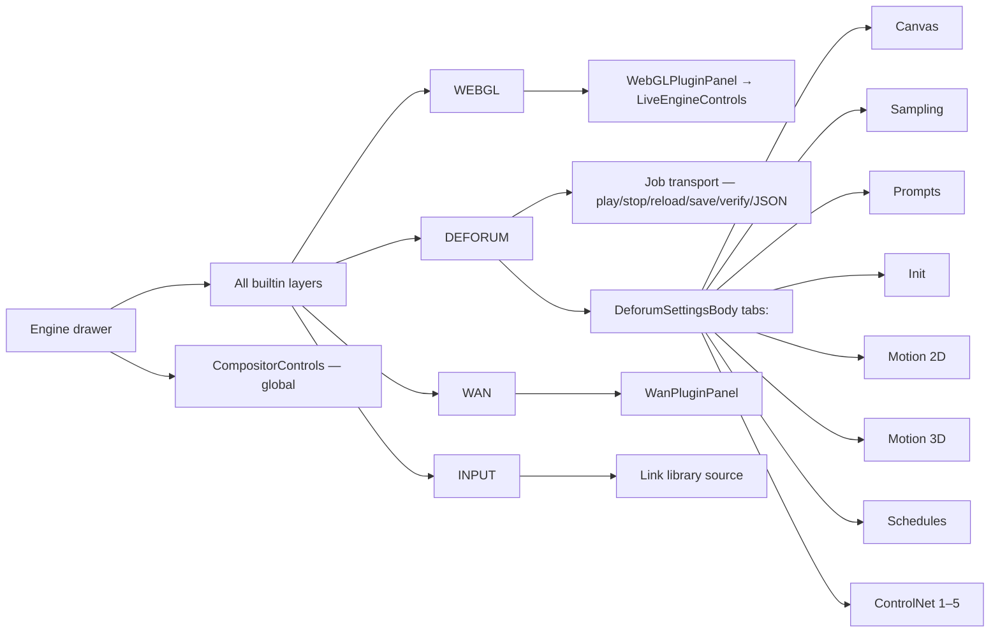

---

## 9. Cross-cutting & orphans (candidates to relocate)

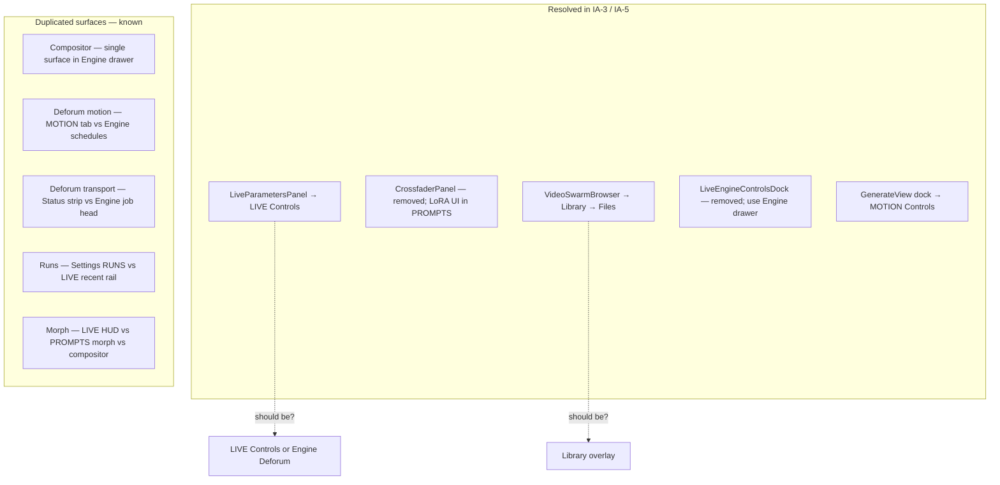

---

## 10. Blank template — your revised layout

Copy this section, edit labels and edges, and paste back when ready.

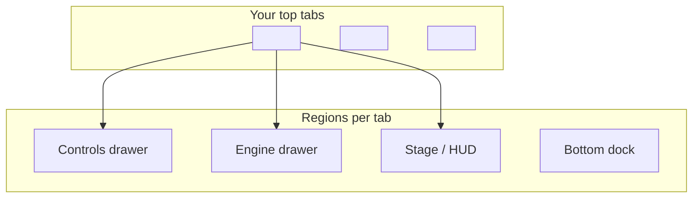

---

## Quick reference table (for spreadsheet edits)

| Feature | Current tab/region | Notes |
|---------|-------------------|--------|
| Video preview | Stage — all tabs | |
| WebGL background | Stage — all tabs | |
| Play/stop Deforum | Status strip | Also engine job panel |
| HLS on stage | Status strip | Config in Settings → OUTPUT |
| Pinned params | LIVE stage HUD | Pins from engine params? |
| Morph crossfader | LIVE stage HUD | Also PROMPTS morph |
| Live vibe/camera sliders | LIVE → Controls | `LiveParametersPanel` |
| WebGL visual sliders | Engine → WebGL | |
| Deforum all settings | Engine → Deforum | |
| Prompt schedules (strings) | Engine → Deforum → Prompts | Not PROMPTS tab |
| Style modifier | PROMPTS → PROMPTS | |
| Prompt morph slots | PROMPTS → PROMPTS | |
| img2img | PROMPTS → IMAGE | |
| LoRAs | PROMPTS → LORA | |
| ControlNet slots | PROMPTS → CONTROLNET | |
| Story generator | PROMPTS → STORY | |
| Motion pads | MOTION → Controls | |
| Sequencer | MOTION → bottom dock | |
| LFOs | MODULATION → LFO | |
| Reference audio | MODULATION → Audio | |
| Audio reactive | AUDIO tab (or MOD → Reactive) | |
| Beat macros | MODULATION → Beat | |
| Mappings | MODULATION → Mappings | |
| Checkpoint / sampling defaults | SETTINGS → ENGINE | |
| Stream / RTMP | SETTINGS → OUTPUT | |
| GPU / Forge pool | SETTINGS → GPUS | |
| Runs browser | SETTINGS → RUNS | |
| MIDI + key bindings | SETTINGS → MIDI | |
| Prompt styles | SETTINGS → STYLES | |
| Plugins registry | SETTINGS → PLUGINS | |
| Collaboration | SETTINGS → COLLAB | |
| Library browse | Library overlay | |
| Video editor | Library overlay | |
| Layers + scenes | Layers rail | |
| Compositor | Engine → Compositor | |
