# Web UI Tabs Reference

The Defora web interface has **8 top-level tabs**: LIVE, PROMPTS, MOTION, MODULATION, AUDIO, RUNS, SETTINGS, GENERATE.

The header also shows a persistent status bar: transport controls (play/stream/frame), health indicator, session ID, and a **Library** icon that opens the fullscreen media workspace.

Visual reference with annotated screenshots: [`docs/ui-migration/00-README.md`](./ui-migration/00-README.md).

---

## 1. LIVE

**Purpose**: Performance stage — the render fills the right panel, controls live on the left.

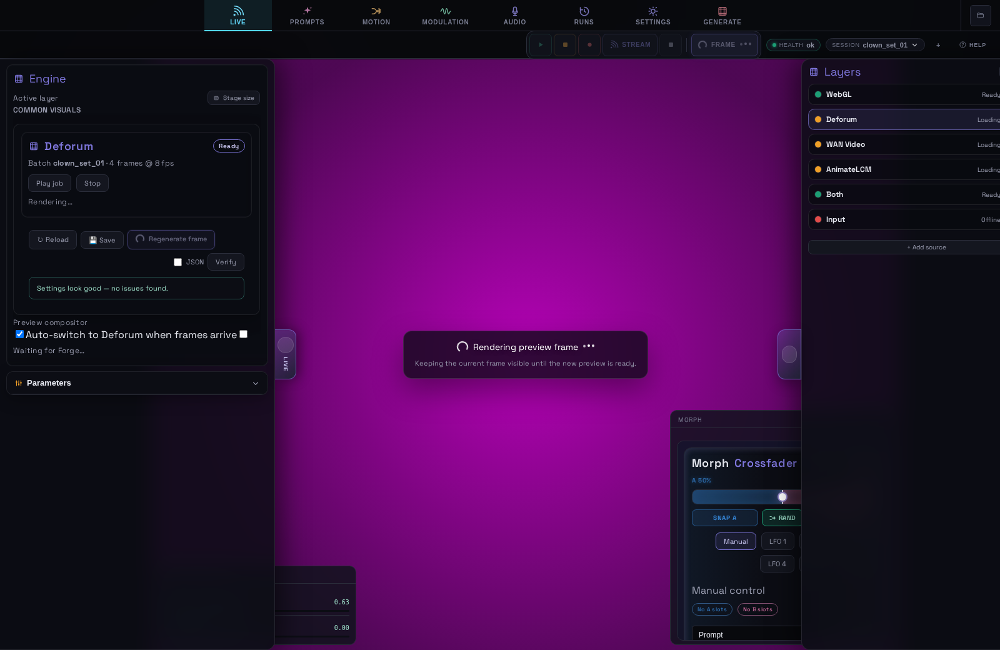

**Left panel sub-tabs**:
- **Controls** — Animation Engine card (active engine badge, video layer picker), Preview source toggle (WebGL / Deforum / WAN Video / AnimateLCM / Both / Input / +Add source), Animation style selector with mode-specific presets.
- **Deforum** — Full Deforum settings editor with grouped fields (dimensions, steps, sampler, motion schedules, etc.).

**Stage HUDs** (glass panels on the preview):
- **Pinned params** (top-left) — quick-access live parameters.
- **Modulating now** (bottom-left) — active LFO / audio routes at a glance.
- **Morph crossfader** (bottom-right) — single A/B morph source for prompts, LoRAs, styles, params.
- **Recent runs rail** — filmstrip of latest completed runs when available.

**Status bar additions**: "Rendering preview frame" pill while a preview is in flight; FPS and latency counters top-right.

**Video layer bar** (bottom): Click a layer chip to switch the stage source without leaving the tab.

---

## 2. PROMPTS

**Purpose**: Prompt authoring, style application, LoRA groups, and ControlNet.

**Sub-tabs**: PROMPTS · IMAGE · LORA · CONTROLNET · STORY

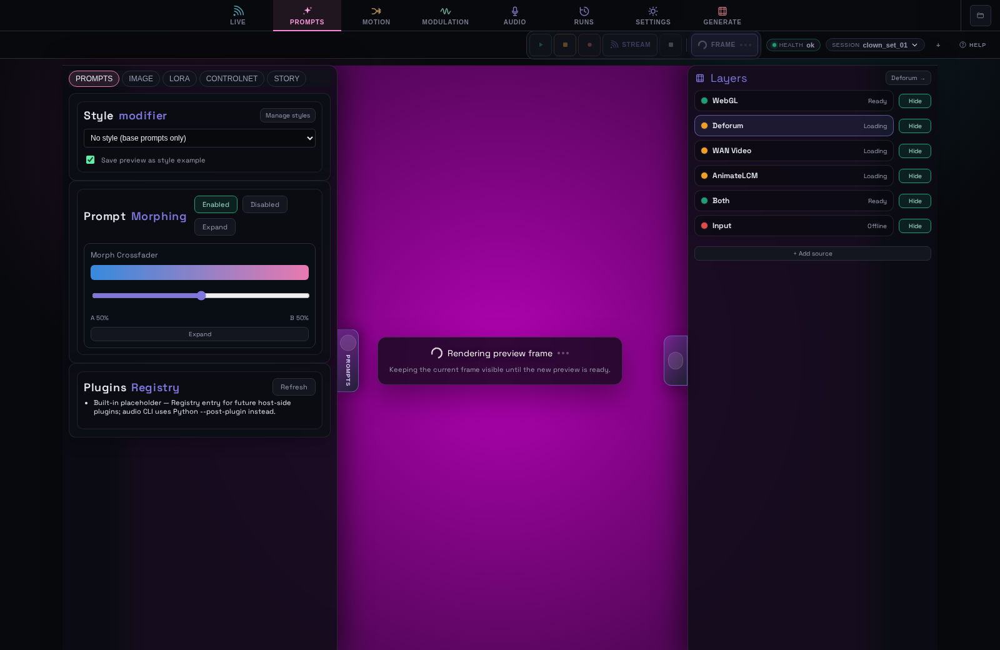

### PROMPTS sub-tab
- **Style modifier** — forge-compatible style preset selector. "Save preview as style example" checkbox.
- **Prompt Morphing** — enable to arm A/B morph slots; the **crossfader lives on LIVE** (not duplicated here).
- **Plugins Registry** — read-only list of installed server-side plugins (`GET /api/plugins`).

### IMAGE sub-tab
- img2img panel with init-image dropzone, optional mask (inpaint), denoising strength.
- Submit fires `POST /api/img2img`; result is available at `/uploads/…` when Forge is reachable.

### LORA sub-tab

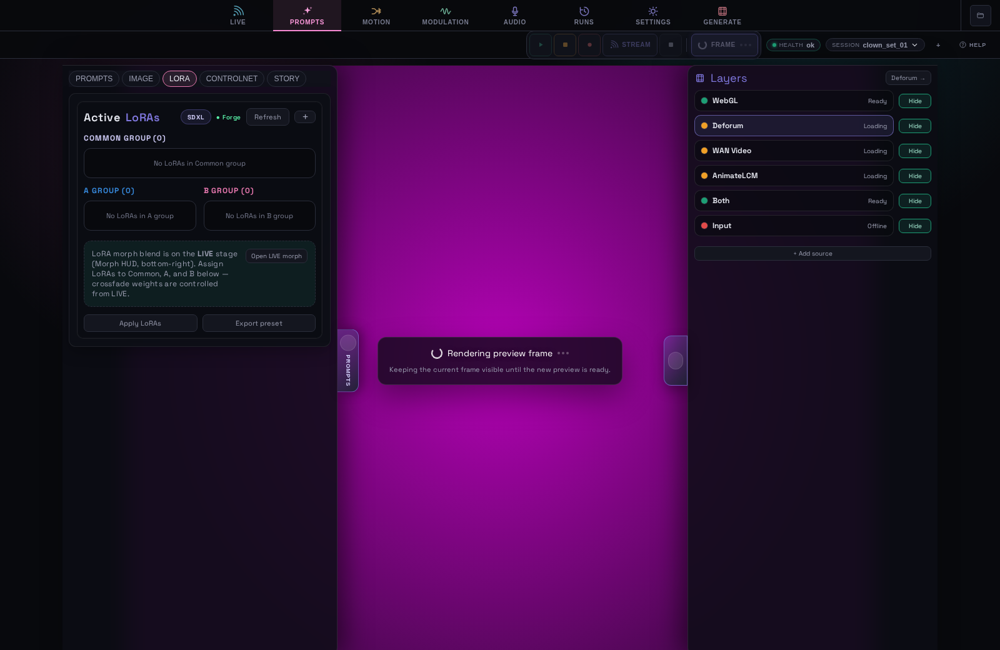

- **Active LoRAs** — shows loaded checkpoint family (SD-XL, SD1.5, etc.) and source (Forge / local).
- **Common Group** — LoRAs always applied at full strength regardless of crossfader position.
- **A Group / B Group** — two palettes blended on the LIVE morph HUD.
- **Apply LoRAs** sends the current blend as a WebSocket `loras` control message.
- **Export preset** saves the current A/B configuration as a JSON preset.

### CONTROLNET sub-tab

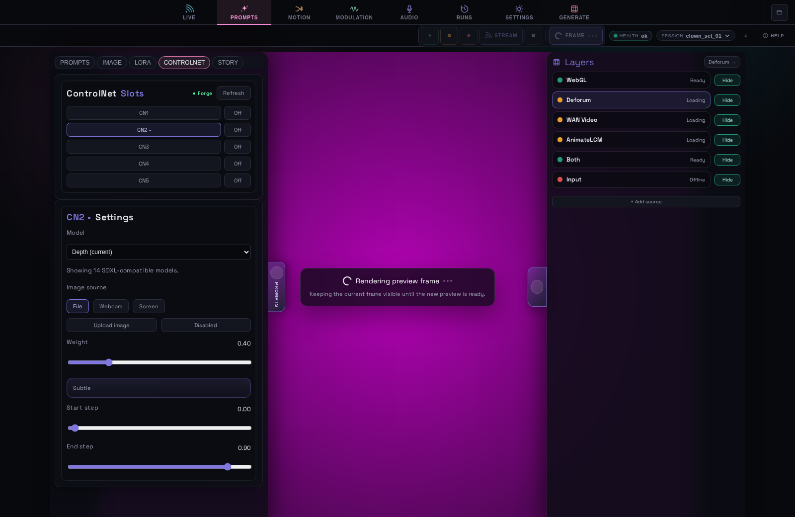

- Up to 4 slots (CN1–CN4), each with model picker filtered to the active checkpoint family.
- Weight slider with visual **strength card** (Subtle / Moderate / Strong / Very strong).
- Enable/disable toggle per slot.
- Webcam and screen-capture upload to `/api/controlnet/upload-image`.

### STORY sub-tab
- Story Generator: theme input, style preset, scene count, width/height, FPS, total frames.
- Generates a Deforum-ready prompt schedule via the configured Ollama node.

---

## 3. MOTION

**Purpose**: Camera motion performance and animation timeline.

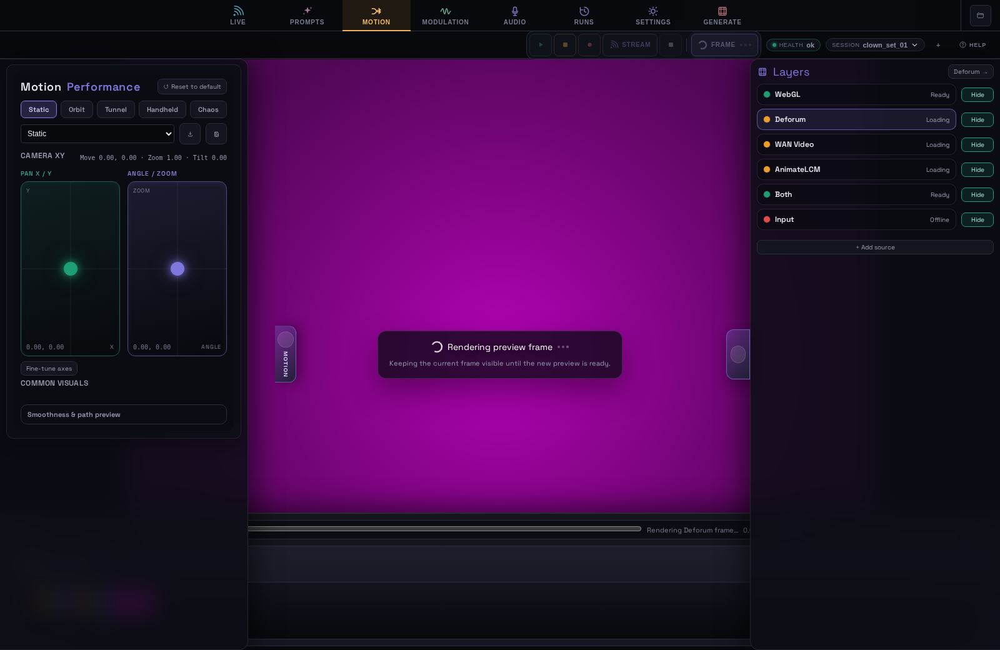

**Features**:
- **Preset pills** — Static · Orbit · Tunnel · Handheld · Chaos at the top of the view.
- **XY hero stage** — full-view performance pad with accent puck glow; fine-tune axes toggle reveals macro sliders.
- **Motion Performance** header shows live Move (X/Y) · Zoom · Tilt values and a **Reset to default** button.
- **Smoothness** checkbox — enables interpolation between pad positions (in advanced panel).
- **2D mode**: dual XY pads — **Move Controls** (translation X/Y) and **Look Controls** (zoom/angle).
- **3D mode**: single 3D motion path preview with axis sliders.
- **Common visual strip** — 8 macro sliders follow the active animation layer plugin.

**Animation Sequencer** docks at the bottom on MOTION and GENERATE:


- Playhead, duration/FPS display, loop toggle.
- TIMELINE strip — frame filmstrip appears as preview frames arrive.
- Track/keyframe editor accessible via the Edit button.
- Save/load timelines via `POST|GET /api/sequencer/:name`.

---

## 4. MODULATION

**Purpose**: LFO, audio, and beat-synced parameter routing.

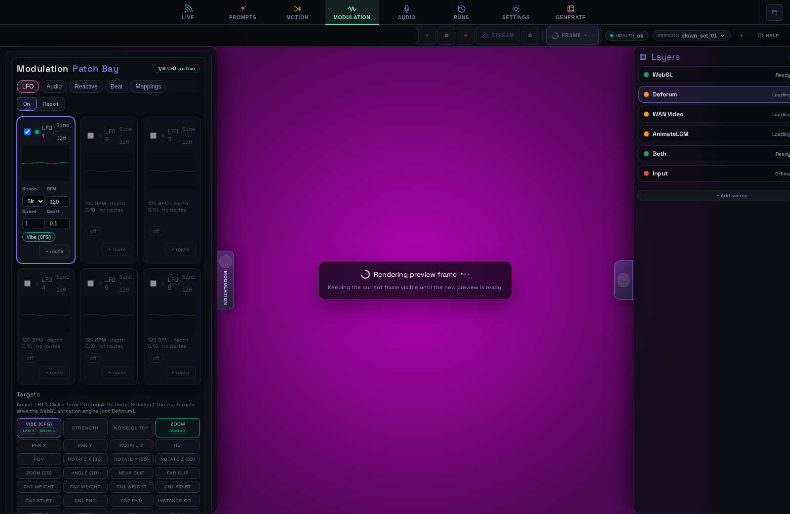

**Sub-tabs**: LFO · Audio · Reactive · Beat · Mappings

### LFO sub-tab (default)
- **Modulation Patch Bay** — six independent LFO cards, waveform-first layout.
- Selected card expands controls; collapsed cards show compact BPM / depth / routes meta line.
- **Targets** panel lists every active route grouped by LFO.
- Global **On / Reset** buttons apply to all active LFOs.

### Audio / Reactive / Beat / Mappings
- See also the dedicated **AUDIO** top-level tab for meter-first reactive mapping.
- Audio sub-tab here: file upload, BPM detection, A/V sync.
- Reactive: spectrum analyser and frequency-to-parameter mapping.
- Beat: beat macros with shape, depth, and target.
- Mappings: flat list of all routes.

---

## 5. AUDIO

**Purpose**: First-class audio-reactive performance surface.

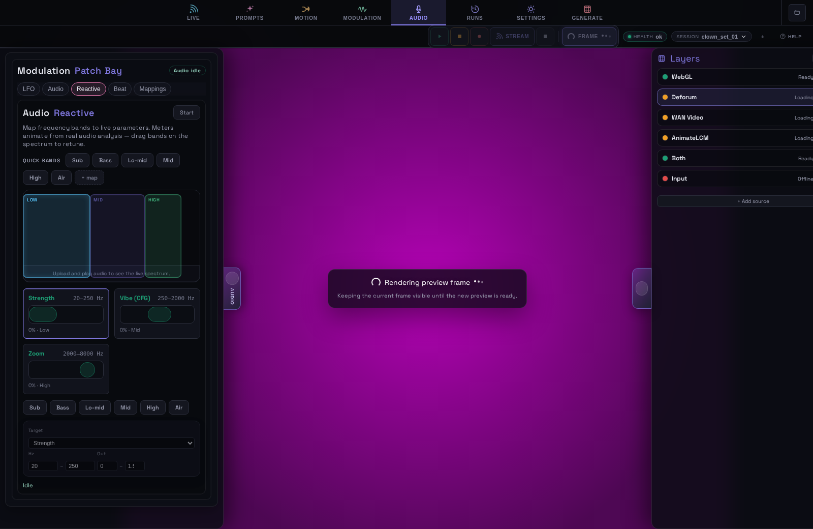

- **Quick-band pills** — sub · bass · low-mid · mid · high-mid · treble · air shortcuts above the spectrum.
- **Spectrum hero** — taller live analyser driven by reference audio.
- Frequency-to-parameter mapping cards with live meters.
- Upload reference audio (WAV/MP3/OGG/FLAC/M4A) and enable A/V sync from MODULATION → Audio when needed.

---

## 6. RUNS

**Purpose**: Full-page generation history and job monitor.

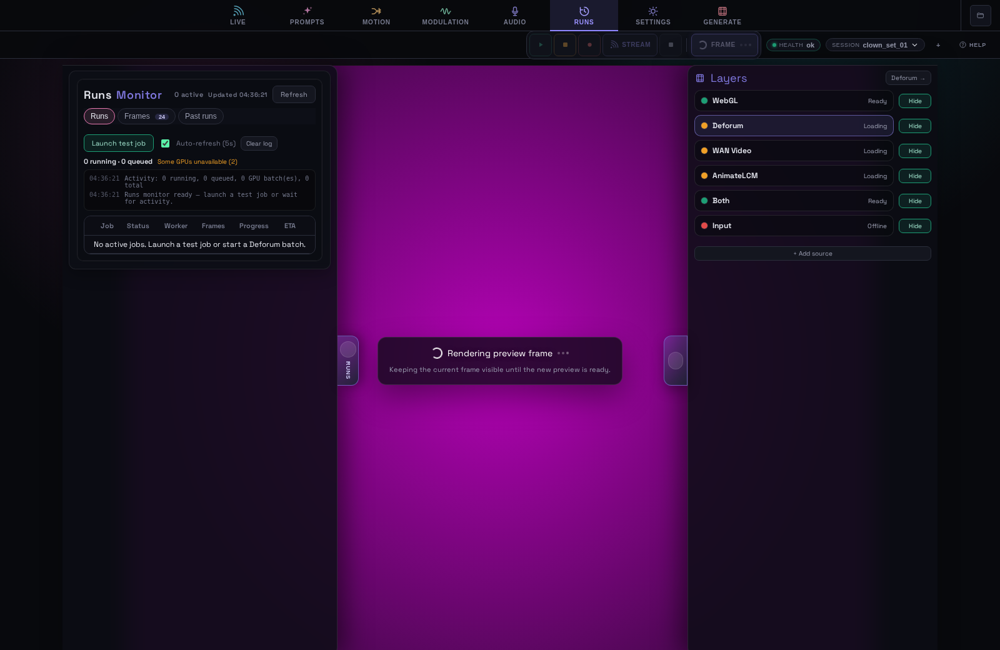

- **Active / Past / Frames** sub-views.
- Running view: active GPU jobs with Kill button for queued batches.
- Detail pane: frame browser, video player, JSON diff against current settings, re-run / continue actions.
- **Launch test run** — submits a demo job to verify the pipeline end-to-end.
- Also available under **SETTINGS → RUNS** (same monitor, embedded in settings rack).

---

## 7. SETTINGS

**Purpose**: Engine, output/streaming, GPU pool, controllers, styles, collaboration.

**Sub-tabs**: ENGINE · OUTPUT · GPUS · RUNS · CONTROLLERS / MIDI · STYLES · COLLAB

### ENGINE sub-tab

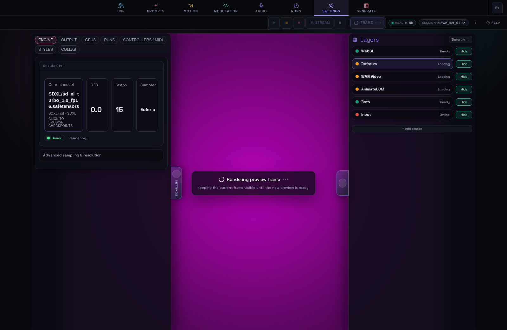

- **Checkpoint GlassPanel** — model name, CFG, steps, sampler summary cards; click to open picker.
- **Advanced sampling & resolution** — progressive disclosure `<details>` for sampler, scheduler, steps, CFG, resolution, FPS, LCM engine, seed.
- **Optimize for model** — applies the recommended SDXL-fast / SD1.5 profile in one click.

### OUTPUT sub-tab (stream)

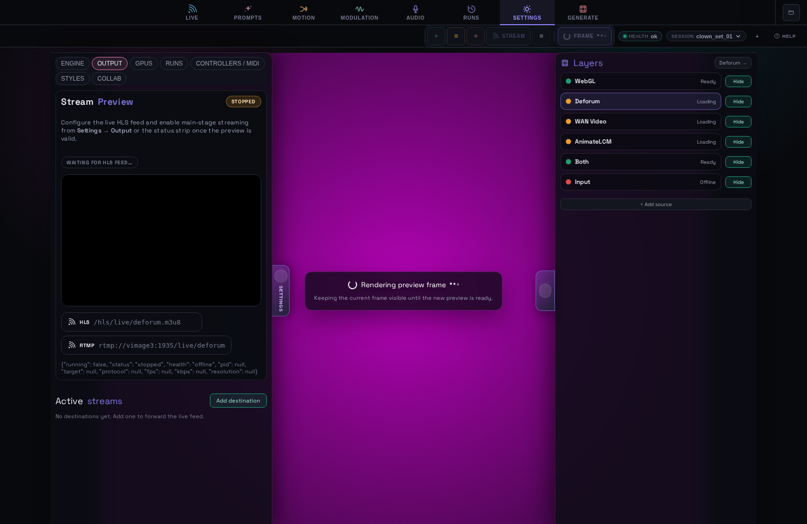

- **Stream Preview** — live HLS thumbnail; status badge turns green once segments arrive.
- HLS playlist path and RTMP ingest address for copy-paste.
- **Active streams** list and **Add destination** for RTMP/SRT/WHIP endpoints.
- HLS watch can also be toggled from the status strip while on LIVE.

### GPUS sub-tab
- GPU pool enable/disable and load-balancing strategy.
- Add SD-Forge, ComfyUI, or Ollama nodes.
- Per-node stats and Forge instance editor modal.

### RUNS sub-tab
- Same runs monitor as the top-level RUNS tab.

### CONTROLLERS / MIDI · STYLES · COLLAB
- Web MIDI bindings, prompt style library, collaboration settings (unchanged scope).

---

## 8. GENERATE

**Purpose**: Timeline authoring and batch generation cues.

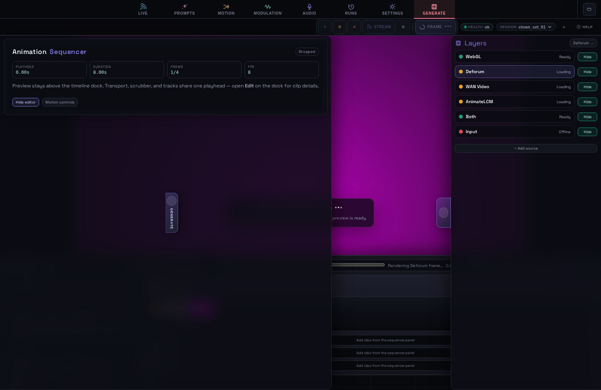

- **Generate dock** under preview — taller timeline strip with sync readout (playhead, duration, job frame, FPS).
- Sequencer controls: transport, loop, clip/markers/keyframe editor drawer.
- Apply timeline converts keyframes to Deforum schedule strings.
- Shares `Timeline.vue` component with MOTION dock but uses dedicated `layout--generate-dock` chrome.

---

## LIBRARY (workspace overlay)

**Purpose**: Browse, organise, and open video files and frame sets. Not a top-level tab — opened from the header **Library** icon.

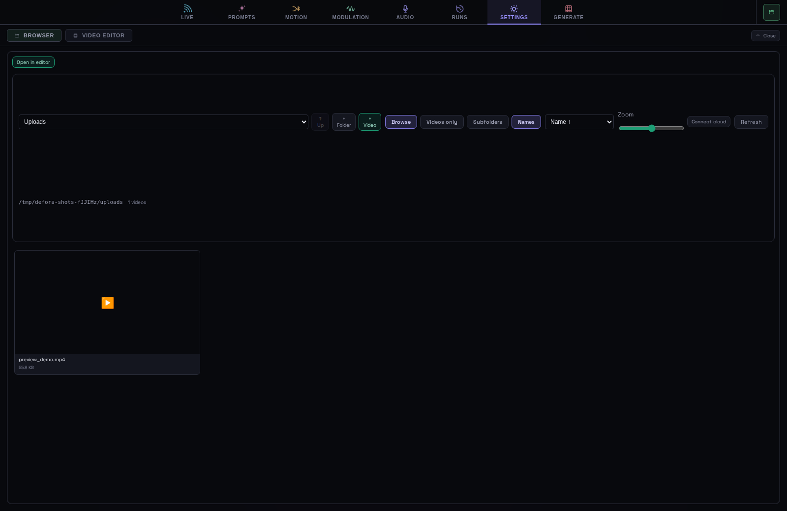

- Root selector (Frames, Runs, Uploads, HLS, VideoSwarm) with zoom slider.
- View mode: Browse / Videos only / Subfolders / Names.
- **Connect cloud** — Google Drive, Dropbox, OneDrive, custom HTTPS.
- **Open in editor** — sends selected clip to trim/export editor.
- Each root shows a hint line explaining where that type of output lands (see table below).

### Where converted / generated files appear

| Library root | Default path (local dev) | What shows up here |
|--------------|--------------------------|-------------------|
| **Uploads** | `docker/web/runs/uploads/` | **img2img / txt2img** → `preview_*.png` (also `GET /uploads/…`). **Stage recording** → `defora_rec_<timestamp>.mp4` after header Record. **Test run export** → `demo-output.mp4`. Uploaded audio/video via + Video. |
| **Uploads → converted/** | `…/uploads/converted/` | Good folder for exports; seed script places samples here (`npm run seed-library`). |
| **Uploads → clips/** | `…/uploads/clips/` | User-organised clip folders (manual or + Folder). |
| **Frames** | `docker/web/frames/` (or `FRAMES_DIR`) | Live Deforum preview **`frame_00000.png`**, … as Forge renders. LIVE layer + **RUNS → Frames** rail. |
| **Runs** | `docker/web/runs/<run_id>/` | Per-job folder: `run.json`, `defora-job.json`, optional **`demo-output.mp4`** inside the run. Listed in **RUNS** tab monitor. |
| **HLS** | `docker/web/hls/` (or `HLS_DIR`) | Stream encoder **`.m3u8`** + **`.ts`** segments; preview in **Settings → Output**. |
| **VideoSwarm** | `docker/web/runs/videoswarm/` | Editor handoff / manual staging (`exports/` subfolder after seed). |

Docker Compose uses `/data/runs`, `/data/frames`, `/data/runs/uploads` — same layout, different mount.

Seed sample folders and videos for the current machine:

```bash
cd docker/web && npm run seed-library
```

---

## Navigation

- The header tab bar is always visible (8 tabs).
- The active tab uses accent underline chrome.
- The video layer bar at the bottom of the stage persists across tab switches.
- Legacy `switchTab('STREAM')` routes to SETTINGS → OUTPUT.

## Visual Theme

All tabs share the same neon-dark shell:
- Background: near-black with subtle blue tint.
- Accent colours: teal (`--live`) for running/modulated · purple (`--accent`) for selected · A = blue · B = pink.
- Font: Space Grotesk.
- Panel cards use glassmorphic dark surfaces (`GlassPanel` on LIVE HUDs and engine checkpoint).
- Status pills, progress rings, and health dots use traffic-light coding (green / amber / red).

See [`docs/ui-migration/style-guide.md`](./ui-migration/style-guide.md) for button and token rules.
