# Defora UI Screenshot Audit — 27 May 2026

Automated capture via `docker/web/test/take-screenshots-audit.mjs`  
Screenshots: [`screenshots/ui-audit-2026-05-27/`](../screenshots/ui-audit-2026-05-27/)  
Viewport: 1600×1040 · seeded demo frames + library project

---

## Executive summary

The app has a **cohesive dark visual language** (glass panels, sub-pills, accent colors per tab). The **Library Projects/Videos split works** and no longer exposes raw folder names. The biggest problems are **functional** (FreeCut editor shows “Not Found”), **information architecture** (Runs buried in Settings; duplicate navigation labels), and **polish** (duplicate card copy, misleading status colors, persistent HEALTH warning).

| Severity | Count | Examples |
|----------|-------|----------|
| 🔴 Critical | 1 | Video editor iframe “Not Found” |
| 🟠 Major | 5 | Duplicate library metadata, Runs discoverability, preview render stuck, WS status color, orphaned “Open in editor” |
| 🟡 Minor | 8 | Triple SETTINGS labels, empty LoRA CTAs, motion sequencer empty state, session naming, sub-pill wrap |

---

## Cross-cutting issues

### 1. Navigation & information architecture 🟠
- Top nav is **6 tabs** (LIVE, PROMPTS, MOTION, MODULATION, AUDIO, SETTINGS). **RUNS** and **GENERATE** are no longer top-level; Runs lives under **SETTINGS → RUNS**.
- Users expecting a dedicated Runs or Generate tab (older docs/tests reference them) will not find them in the main nav.
- **Recommendation:** Restore RUNS as a top-level tab, or add a sticky sub-nav under SETTINGS when active.

### 2. Duplicate edge labels 🟡
- **SETTINGS** appears as: top tab · vertical edge tab on preview · panel context.
- Same pattern on PROMPTS, MOTULATION, AUDIO, MOTION.
- **Recommendation:** Keep one primary label; edge tabs should be icon-only tooltips.

### 3. HEALTH! badge 🟡
- Orange **HEALTH!** shows on every page. Meaning is unclear; reads like an error but may be nominal.
- **Recommendation:** Green “OK” when healthy; orange/red only on degradation, with tooltip.

### 4. Session default name 🟡
- Default session **clown_set_01** appears in chrome on all captures.
- **Recommendation:** Neutral default (`session_01` or date-based).

---

## Page-by-page audit

### Overview — default LIVE landing

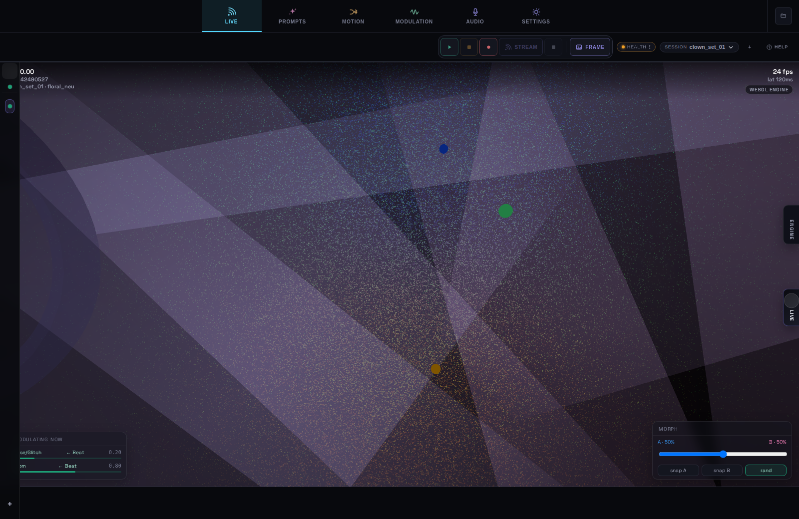

**What works**
- Clean top nav; LIVE stage dominates viewport.
- Morph HUD (bottom-right) and modulating-now strip (bottom-left) are readable overlays.
- WebGL engine badge and fps/latency overlay are useful.

**Issues**
- 🟡 Preview content is abstract/noisy — fine for dev, not representative for demos.
- 🟡 Small HUD text on busy backgrounds may fail contrast on some frames.

---

### LIVE — main stage

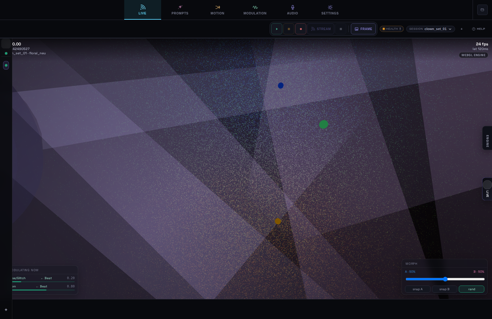

**What works**
- Full-bleed stage layout; layer/engine edge tabs on the right.
- Transport (play/stop/record/stream/frame) grouped in header.

**Issues**
- 🟡 **Engine drawer** not captured — bottom drawer toggle may be hidden or requires extra interaction; engine controls are less discoverable than edge “ENGINE” tab.
- 🟡 Duplicate “LIVE” label (top tab + edge tab).

**Note:** `02-live-engine-drawer.png` was not produced — engine drawer did not open during capture.

---

### PROMPTS — Prompt morphing

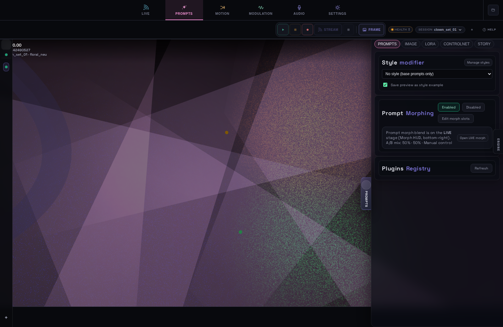

**What works**
- Sub-pills (PROMPTS / IMAGE / LORA / CONTROLNET / STORY) match design system.
- “Open LIVE morph” bridges PROMPTS ↔ LIVE morph HUD.
- Style modifier block is clear.

**Issues**
- 🟡 Right panel title “Engine” while tab is PROMPTS — naming mismatch.
- 🟡 Plugins registry section is sparse (only Refresh).

---

### PROMPTS — Image

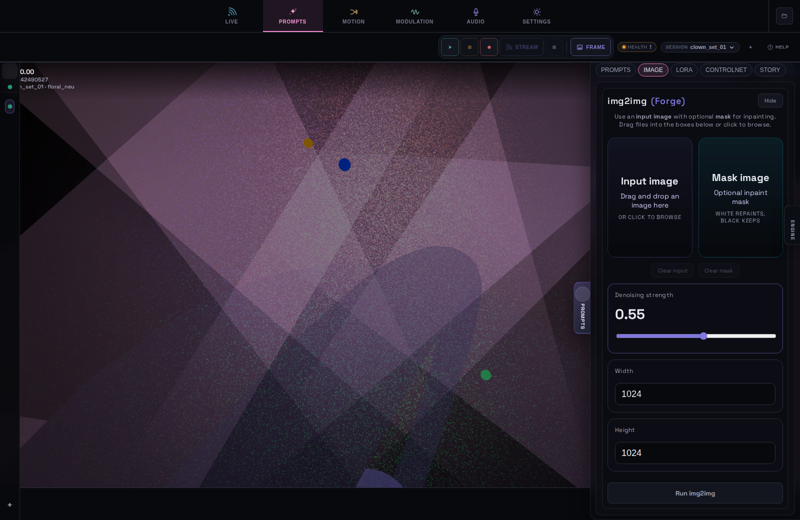

**What works**
- img2img drop grid and Forge status visible.

**Issues**
- 🟡 Panel density varies heavily between PROMPTS sub-tabs (Image is sparse vs LoRA).

---

### PROMPTS — LoRA

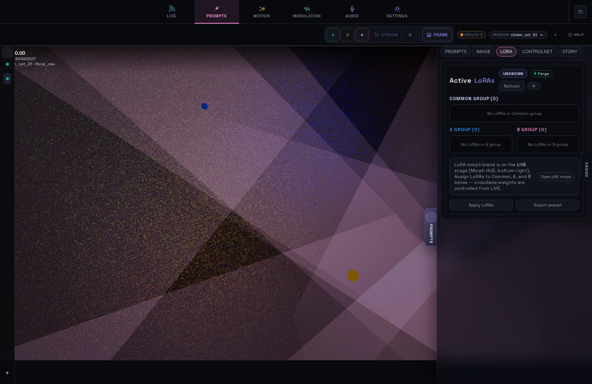

**What works**
- Forge connection status (UNKNOWN / Forge) shown.
- Common / A / B groups communicate morph workflow.

**Issues**
- 🟡 **Apply LoRAs** and **Export preset** appear disabled / very low contrast — easy to miss as actions.
- 🟡 All groups empty with no sample LoRA cards — empty state could suggest “Refresh” or link to Forge.

---

### PROMPTS — ControlNet

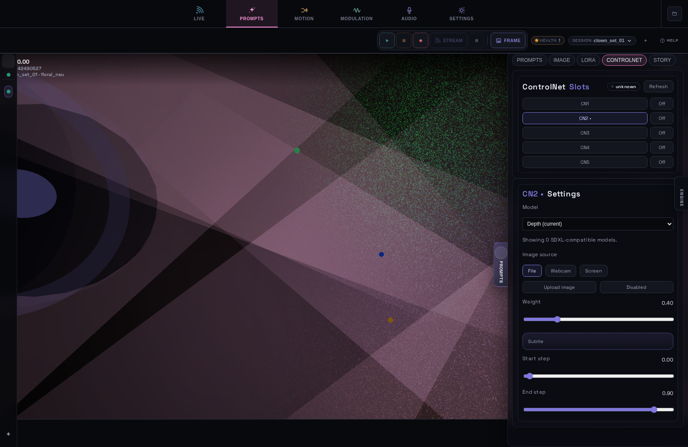

**What works**
- CN slot structure and Forge hint consistent with LoRA tab.

**Issues**
- 🟡 Same empty-state pattern as LoRA — no guided first step.

---

### MOTION — Performance pad

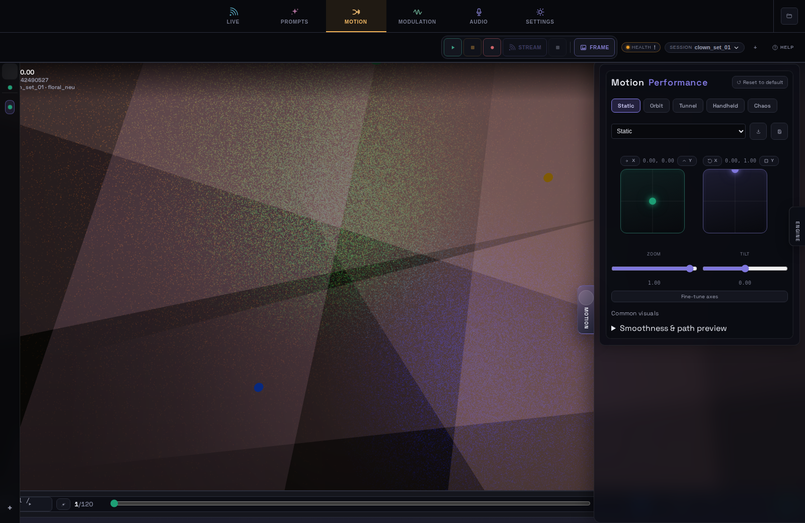

**What works**
- Motion Performance panel: mode pills, XY pads, zoom/tilt sliders — strong visual hierarchy.
- Purple accent matches MOTION tab color.

**Issues**
- 🟡 Timeline bar at bottom shows `1 / 120` but no filmstrip thumbs in this view (see sequencer shot).

---

### MOTION — Sequencer dock

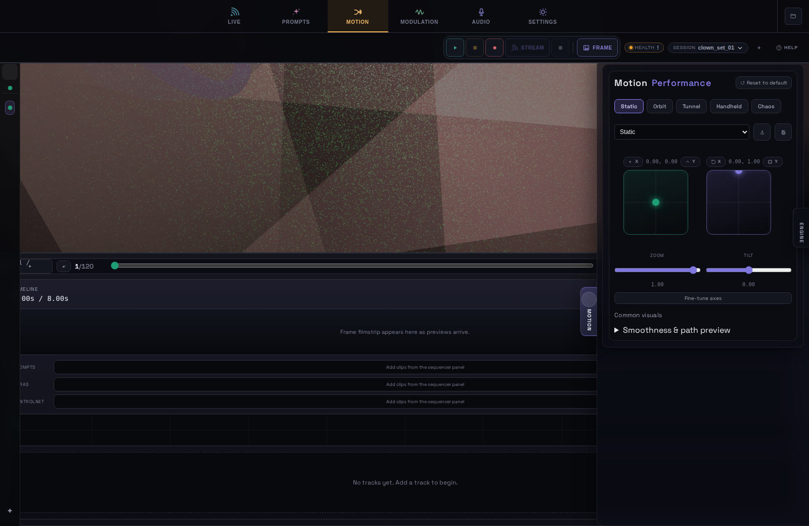

**What works**
- Timeline dock under preview; PROMPTS / RAS / CONTROLNET lanes visible.
- Motion panel remains accessible alongside sequencer.

**Issues**
- 🟠 **Conflicting empty state:** lanes say “Add clips from the sequencer panel” while footer says **“No tracks yet. Add a track to begin.”**
- 🟡 Filmstrip placeholder text only — no seeded frames in rail here.

---

### MODULATION — Patch bay

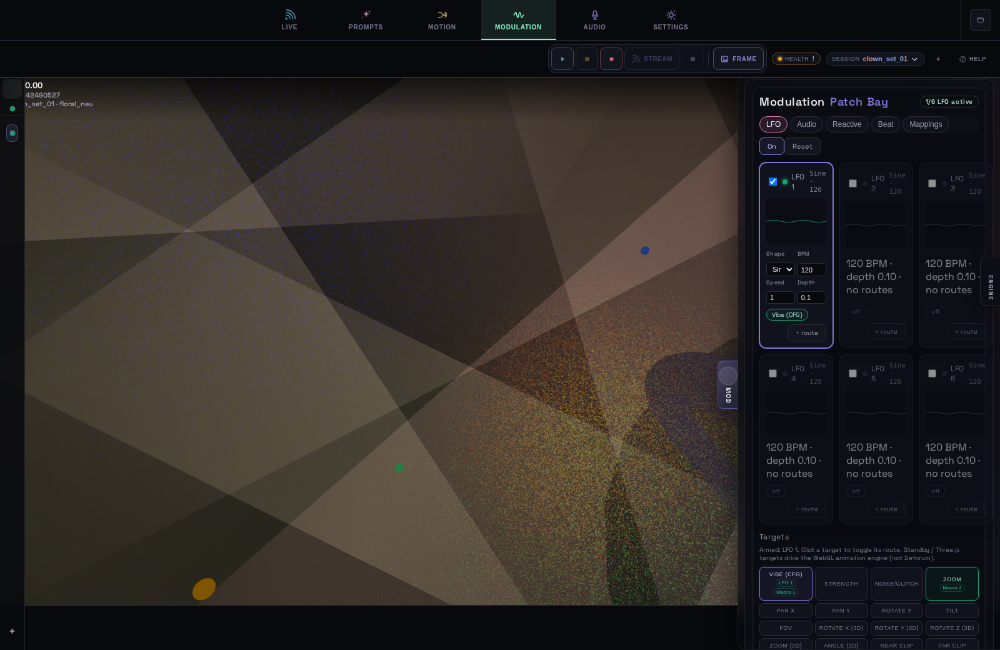

**What works**
- LFO grid (1 active / 6 slots) is scannable.
- Target matrix at bottom; armed LFO routing is clear (VIBE, ZOOM highlighted).

**Issues**
- 🟡 Target grid is dense — 20+ buttons may overflow on smaller viewports.
- 🟡 Only LFO 1 active; slots 2–6 identical “off” rows — consider collapse when unused.

---

### AUDIO — Reactive panel

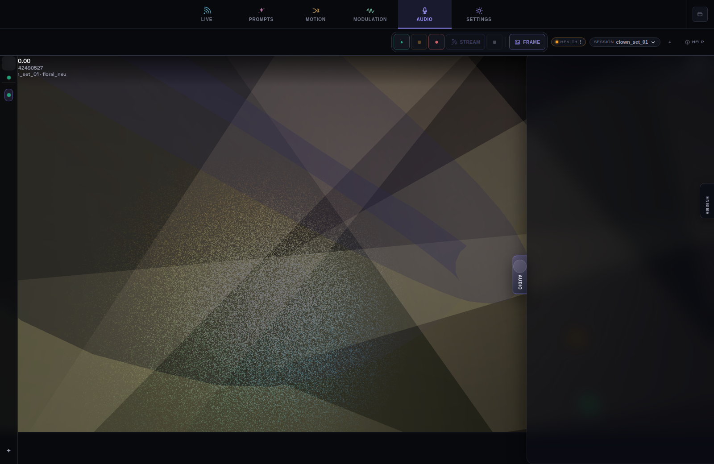

**What works**
- LOW / MID / HIGH band cards with color coding.
- Quick band pills and mapping controls follow same language as Modulation.

**Issues**
- 🟡 **Duplicate “Audio Reactive” header** (title appears twice in panel).
- 🟡 Spectrum placeholders until audio uploaded — expected, but no prominent “Upload audio” CTA in panel.

---

### SETTINGS — Runs monitor

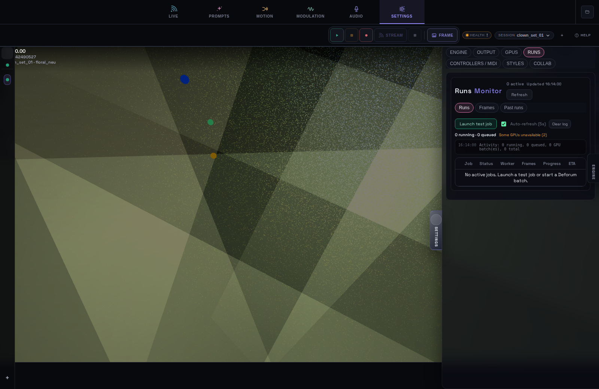

**What works**
- Runs / Frames / Past runs sub-tabs inside monitor.
- Launch test job + Refresh + Clear log actions present.

**Issues**
- 🟠 **Discoverability:** Runs is critical ops surface but buried under SETTINGS.
- 🟡 “0 running · 0 queued · Some GPUs unavailable (2)” — GPU warning with no inline explanation link.

---

### SETTINGS — Runs frames rail

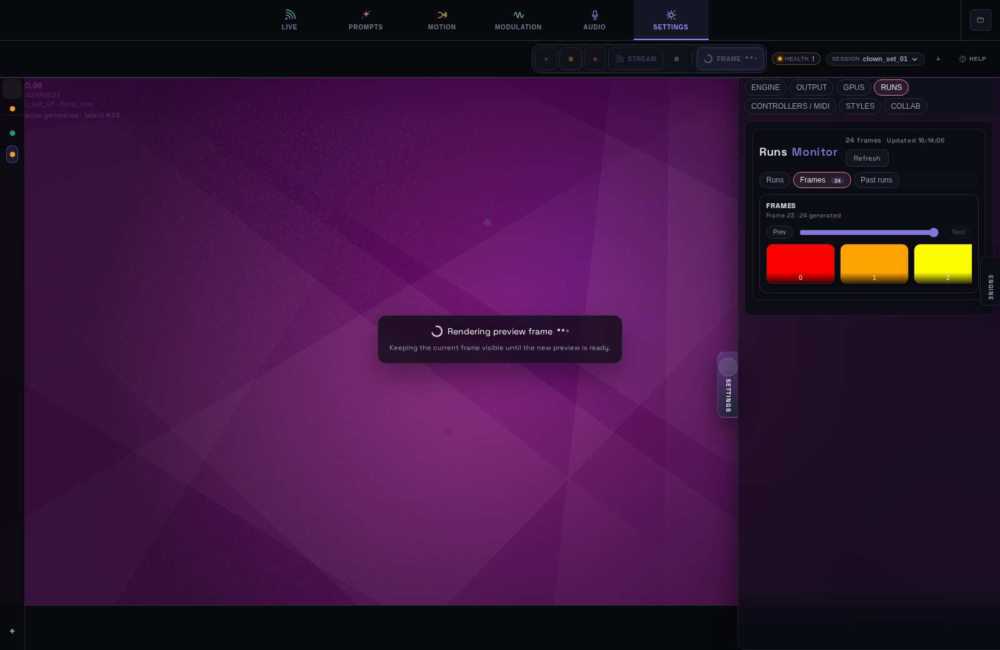

**What works**
- Frames rail with generated count and refresh.

**Issues**
- 🟡 Empty rail in capture — expected without active job, but no illustration/placeholder thumbs.

---

### SETTINGS — Engine

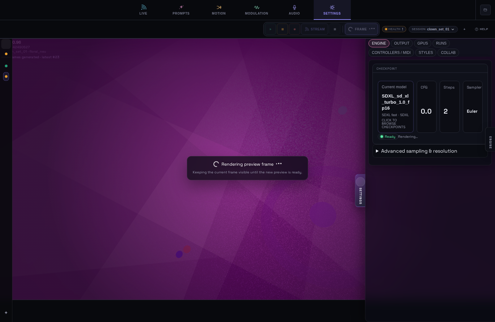

**What works**
- Checkpoint card, CFG/Steps/Sampler cards, Advanced accordion.
- Loading overlay: “Rendering preview frame…” with spinner — good lazy-load pattern.

**Issues**
- 🟠 Preview stuck on **“Rendering preview frame…”** — Deforum preview fetch failed in log (`fetch failed` to Forge). User sees indefinite loading overlay.
- 🟡 Status line **“Ready Rendering…”** is contradictory copy.

---

### SETTINGS — Output / stream

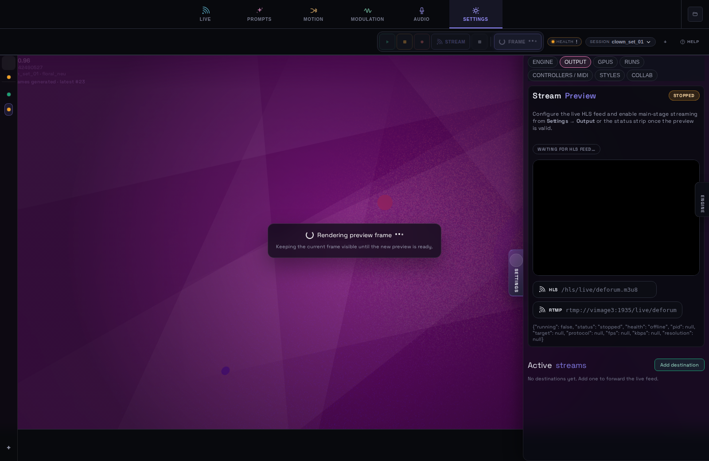

**What works**
- Stream destinations and record controls relocated from old STREAM tab.

**Issues**
- 🟡 Stream button in header still disabled/grey while OUTPUT panel exists — two stream entry points may confuse.

---

### SETTINGS — GPUs

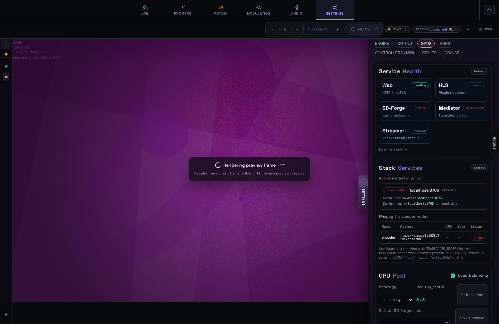

**What works**
- Infrastructure panel with worker/GPU cards.

**Issues**
- 🟡 None significant in capture.

---

### SETTINGS — MIDI

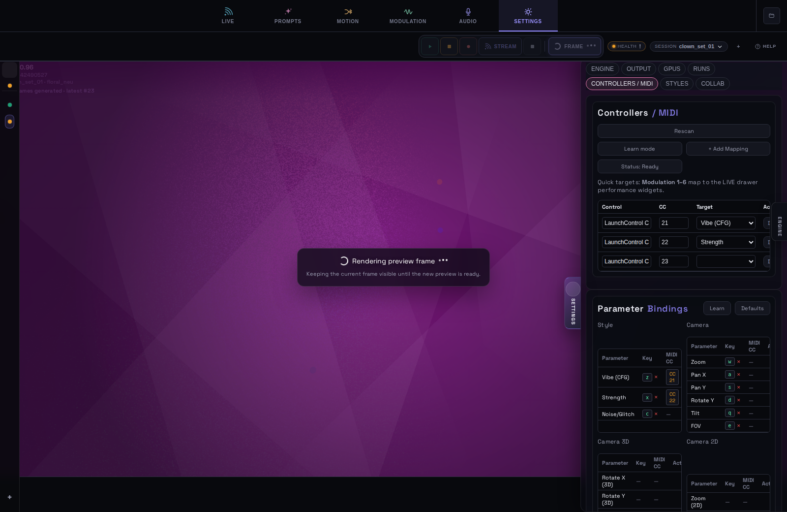

**What works**
- Controller mapping section under unified settings sub-pills.

**Issues**
- 🟡 Long label **“CONTROLLERS / MIDI”** wraps awkwardly in sub-pill row.

---

### SETTINGS — Styles

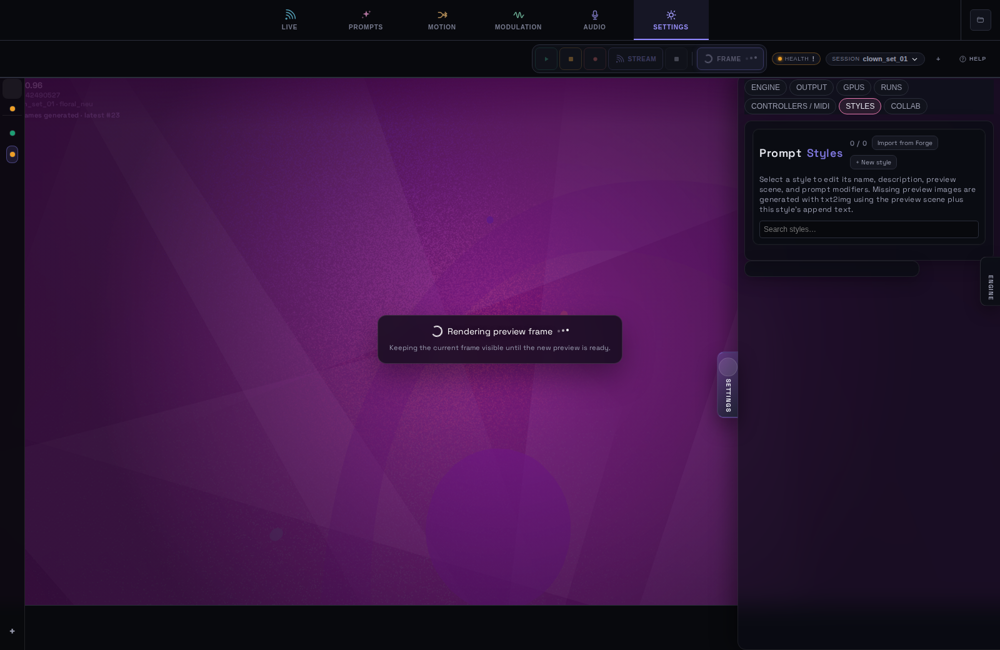

**What works**
- Styles panel for prompt/style library.

**Issues**
- 🟡 None significant in capture.

---

### SETTINGS — Collab

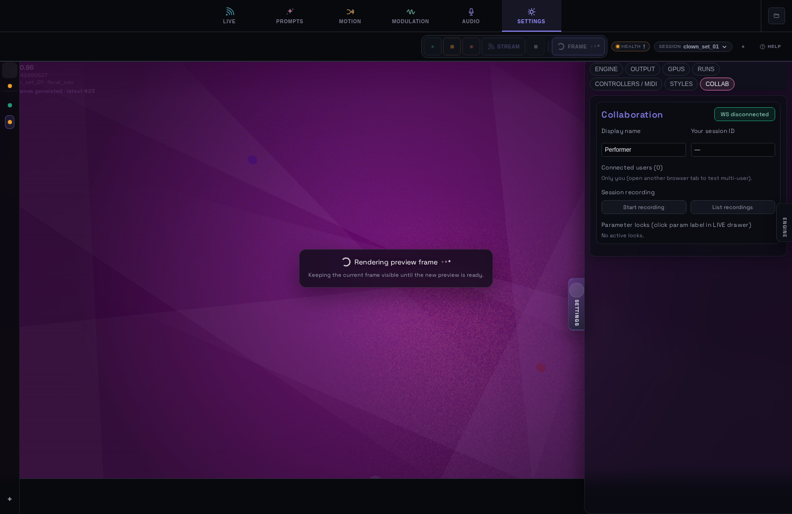

**What works**
- WS session ID, display name, recording controls.

**Issues**
- 🟠 **“WS disconnected”** inside a **green-bordered** box — color implies success while text says disconnected. Should be neutral/red when offline.
- 🟡 Session ID shows `---` with no connect action visible.

---

### Library — Projects

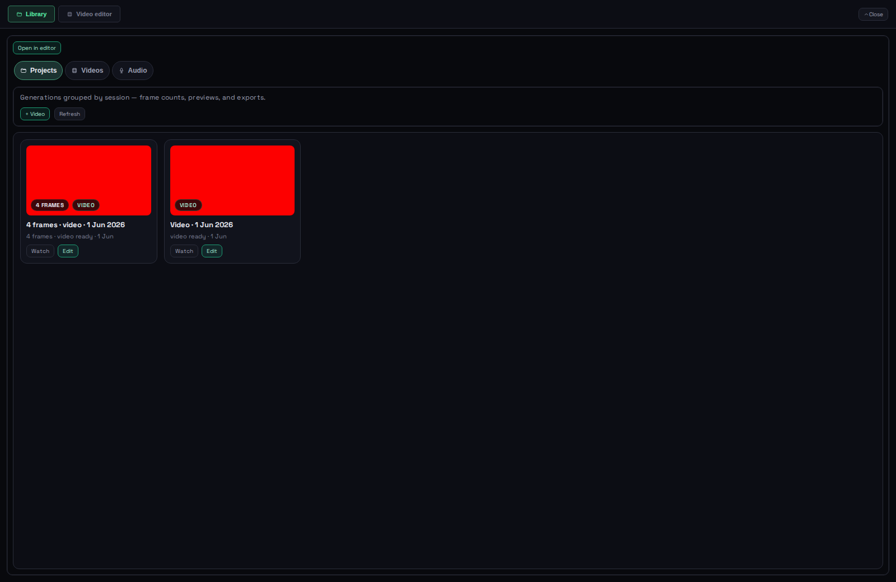

**What works**
- **Projects | Videos** sub-pills prominent with icons — matches request.
- Cards show frame count + video badges; Watch / Edit actions on each card.
- No raw folder names in titles (`4 frames · video · 1 Jun 2026`).

**Issues**
- 🟠 **Duplicate metadata:** title line and meta line repeat the same info (`4 frames · video · date` twice).
- 🟡 **“Open in editor”** button floats above tabs without clear selection context.
- 🟡 Thumbnails are solid color blocks (seed data) — layout OK; real content should show frame/video poster.
- 🟡 Only 2 cards in large empty dropzone — consider tighter empty-state art when library is sparse.

---

### Library — Videos

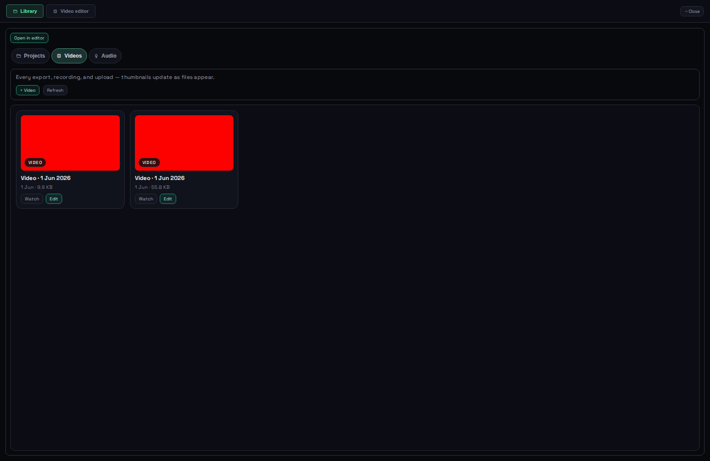

**What works**
- Flat video list with VIDEO badge, date, file size in meta.
- Same card component as Projects — design language consistent.
- Refresh + upload actions mirrored from Projects tab.

**Issues**
- 🟡 Same thumbnail/poster behavior as Projects (solid red from seeded ffmpeg frames).
- 🟡 **Recording** badge type exists in code but not visible on these items (only VIDEO badge shown).

---

### Library — Video editor (FreeCut)


**What works**
- Editor tab chrome: Projects / Open tab / Copy import URL / Import from library.
- “FreeCut ready” status bar when shell loads.

**Issues**
- 🔴 **Critical: iframe shows “Not Found”** — FreeCut embed fails to load in this environment. Editor tab is broken for users.
- 🟠 Import URL handoff may be ready but **timeline never appears** — blocks core library → edit workflow.
- 🟡 “Projects” button in editor header duplicates library navigation.

---

## Recommended fix order

1. 🔴 **Fix FreeCut embed** — verify `/freecut/` route, iframe `src`, base path, and CSP in production and headless CI.
2. 🟠 **Deforum preview error handling** — timeout overlay on SETTINGS → ENGINE; don’t spin forever when Forge unreachable.
3. 🟠 **Library card copy** — show title once; meta only for secondary info (date, size).
4. 🟠 **Runs discoverability** — top-level RUNS tab or persistent SYSTEM entry from LIVE.
5. 🟠 **Collab WS status colors** — red/grey disconnected, green connected.
6. 🟡 **Motion sequencer copy** — reconcile “No tracks yet” vs pre-defined lanes.
7. 🟡 **LoRA primary buttons** — enable styling when Forge connected; increase contrast when disabled.
8. 🟡 **Audio panel** — remove duplicate header; add upload CTA.
9. 🟡 **HEALTH badge semantics** — only warn when unhealthy.

---

## How to regenerate

```bash
cd docker/web
OUT_DIR=../../screenshots/audit-ui-$(date +%Y-%m-%d) node test/take-screenshots-audit.mjs
```

---

*Generated from automated Playwright capture and visual review.*
