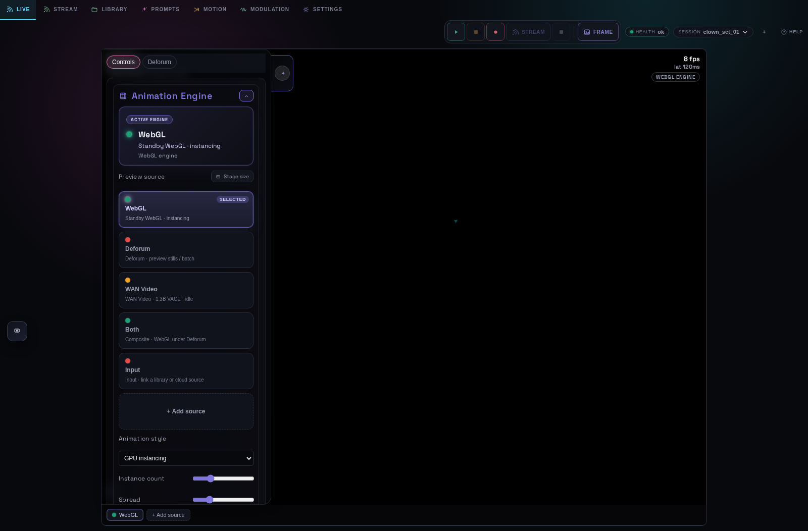

# UI migration — design language

This folder is the canonical reference for migrating the Defora web UI to the
**instrument** design language (control panel → performance surface).

| File | Purpose |
|------|---------|
| [style-guide.md](./style-guide.md) | Buttons, pills, tokens, and component class names |
| [../ui-refactor/02-mockups.html](../ui-refactor/02-mockups.html) | Full-page visual mockups (open in browser) |
| [../ui-refactor/01-declutter-brief.md](../ui-refactor/01-declutter-brief.md) | Declutter execution order and acceptance criteria |
| [../WEB_UI_TABS.md](../WEB_UI_TABS.md) | Full tab / sub-tab reference (8 top-level tabs) |

**Core rule:** teal `--live` = active/modulated · purple `--accent` = selected ·
A = blue · B = pink · idle controls use `--bg-3` inset surfaces.

Implementation lives in `docker/web/src/style.css` (`:root` tokens + `.framesync-button` system).

---

## Visual tour (U-21–U-29 migration)

Screenshots live in [`screenshots/`](../../screenshots/). Regenerate with:

```bash
cd docker/web && npm run build && node test/take-screenshots.mjs
```

<table>
<tr>
<td width="50%">
<h4>LIVE — performance stage</h4>

<p><b>①</b> Top nav — eight first-class tabs (LIVE → GENERATE). <b>②</b> Left rack: animation engine picker, layer selector, preview source. <b>③</b> Stage HUDs: pinned params (top-left), modulating-now (bottom-left), morph crossfader (bottom-right). <b>④</b> Recent-runs filmstrip when runs exist. <b>⑤</b> Layer bar at bottom switches WebGL / Deforum / WAN / AnimateLCM / Both / Input.</p>
</td>
<td width="50%">
<h4>PROMPTS — words &amp; styles</h4>

<p><b>①</b> Sub-pills: PROMPTS · IMAGE · LORA · CONTROLNET · STORY. <b>②</b> Style modifier with forge-compatible presets. <b>③</b> Prompt morphing enable — A/B blend on LIVE Morph HUD only (hint + slot editors here). <b>④</b> Generic prompt + history on LIVE crossfader panel.</p>
</td>
</tr>
<tr>
<td width="50%">
<h4>PROMPTS → LoRA</h4>

<p><b>①</b> Active LoRAs for current checkpoint family. <b>②</b> Common / A / B group assignment — no inline crossfader here (morph on LIVE). <b>③</b> Hint links to LIVE morph HUD for tempo-synced blending.</p>
</td>
<td width="50%">
<h4>PROMPTS → ControlNet</h4>

<p><b>①</b> Up to four CN slots filtered to active checkpoint family. <b>②</b> Per-slot enable toggle and weight strength card. <b>③</b> Webcam / screen / file upload per slot.</p>
</td>
</tr>
<tr>
<td width="50%">
<h4>MOTION — XY hero</h4>

<p><b>①</b> Preset pills (Static, Orbit, Tunnel, …) above the hero stage. <b>②</b> Full-view XY pad with accent puck glow. <b>③</b> Fine-tune axes toggle reveals macro sliders without leaving the hero. <b>④</b> Common visual strip follows the active animation layer plugin.</p>
</td>
<td width="50%">
<h4>MOTION — sequencer dock</h4>

<p><b>①</b> Animation sequencer timeline docks under the preview on MOTION. <b>②</b> Transport, playhead scrub, and Edit drawer for keyframes / clips / markers. <b>③</b> Path preview and smoothness in collapsible advanced panel.</p>
</td>
</tr>
<tr>
<td width="50%">
<h4>MODULATION — waveform-first LFOs</h4>

<p><b>①</b> Six LFO cards — waveform hero when selected; compact BPM/depth/routes line when collapsed. <b>②</b> Sub-pills: LFO · Audio · Reactive · Beat · Mappings. <b>③</b> Teal active / dim idle card chrome.</p>
</td>
<td width="50%">
<h4>AUDIO — meter-first reactive</h4>

<p><b>①</b> First-class top tab (no longer buried in MODULATION). <b>②</b> Quick-band pills (sub · bass · mid · …) above the spectrum hero. <b>③</b> Frequency-to-parameter mapping cards with live meters.</p>
</td>
</tr>
<tr>
<td width="50%">
<h4>RUNS — history browser</h4>

<p><b>①</b> Full-page runs monitor (replaces bottom drawer). <b>②</b> Active / Past / Frames tabs with kill for queued jobs. <b>③</b> Detail pane: frame browser, video, JSON diff, re-run.</p>
</td>
<td width="50%">
<h4>GENERATE — timeline dock</h4>

<p><b>①</b> Dedicated generate dock under preview (`layout--generate-dock`). <b>②</b> Sync readout: playhead, duration, job frame, FPS. <b>③</b> Timeline strip + side editor for clips, keyframes, markers.</p>
</td>
</tr>
<tr>
<td width="50%">
<h4>SETTINGS → Engine</h4>

<p><b>①</b> Sub-tab order: ENGINE · OUTPUT · GPUS · RUNS · CONTROLLERS / MIDI · STYLES · COLLAB. <b>②</b> Checkpoint GlassPanel with CFG / Steps / Sampler summary cards. <b>③</b> Advanced sampling, resolution, LCM, seed in progressive disclosure `<details>`.</p>
</td>
<td width="50%">
<h4>SETTINGS → Output (stream)</h4>

<p><b>①</b> Stream preview and HLS/RTMP addresses (formerly top-level STREAM tab). <b>②</b> Active destinations list and Add destination. <b>③</b> HLS watch from status strip works without leaving LIVE.</p>
</td>
</tr>
<tr>
<td width="50%">
<h4>LIBRARY</h4>

<p><b>①</b> Top-nav folder icon opens fullscreen library workspace overlay (not a main tab). <b>②</b> Browser + Video editor panes. <b>③</b> Root selector (Uploads default), videos-only, cloud connect, Open in editor.</p>
</td>
<td width="50%">
<h4>Landing overview</h4>

<p>Default cold-start state: LIVE tab, WebGL layer, session overlay. Use this shot to verify nav chrome and stage proportions after layout changes.</p>
</td>
</tr>
</table>

### Migration status (roadmap U-21–U-29)

| Phase | Status | Key change |
|-------|--------|------------|
| U-21 | Done | 8-tab nav; STREAM → SETTINGS Output |
| U-22 | Done | Remove perf bottom drawer |
| U-23 | Done | LIVE stage HUDs (morph, modulating-now, runs rail) |
| U-24–U-25 | Done | Waveform-first LFO; audio band hero |
| U-26 | Done | Motion XY hero + preset pills |
| U-27 | Done | Single morph crossfader on LIVE (PROMPTS hint + slot editors only) |
| U-28 | Done | Generate timeline dock |
| U-29 | Done | Settings progressive disclosure; SYSTEM → RUNS |
| U-30 | Done | Token / hex sweep; library + remove controls use UiIcon |
